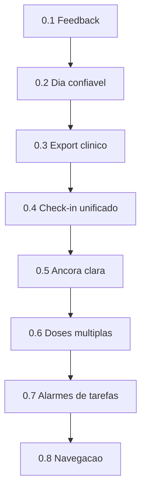

# Fase 0 Feedback — plano de implementação

Documento à parte do [GDD.md](GDD.md). Detalha a **subfase Feedback da Fase 0**: correções e melhorias vindas da análise de uso real (07/10/2026). Não substitui o roadmap §12; completa o que entra antes (e em paralelo controlado) do TestFlight.

**Fonte da lista:** nota “Minha análise.” — 14 tópicos sem ordem de prioridade.  
**Ordem abaixo:** valor para o projeto e confiança no uso diário, não a ordem da nota.

---

## Princípio norteador

> Foco inicial em ferramentas de funcionamento pessoal, sem priorizar ferramentas de SDK.

Vale para **toda** esta subfase:

- Priorizar rotina, remédios, tarefas, check-in, export e navegação **locais**.
- Espelho HealthKit / Health Connect que já existe continua; não abrir ponte nova nem Lembretes nativos (`EKReminder`) aqui.
- Itens FUT-* e Fase 2 (ponte mútua ampla) ficam fora.

---

## Mapa nota → fase

| # | Tópico da nota | Fase |
|---|----------------|------|
| 1 | Botão / área de feedback ou report de bugs | **0.1** |
| 2 | Copos d’água não reiniciar até o fim do dia | **0.2** |
| 3 | Lembrete de remédio não reiniciar até o fim do dia | **0.2** |
| 4 | Modularidade para remédios com mais de uma dose/dia | **0.6** |
| 5 | Clareza / possível rename da “âncora do dia” | **0.5** |
| 6 | Tarefas × lembretes do celular / clareza dos alarmes | **0.7** |
| 7 | Foco em funcionamento pessoal, não SDK | **Princípio** (todas as fases) |
| 8 | Pautas para terapia não exportadas | **0.3** |
| 9 | Estado emocional não exportado | **0.3** |
| 10 | Tarefas não exportadas | **0.3** |
| 11 | “Como meu dia fechou” não exportado | **0.3** |
| 12 | Check-in rápido com 2 nomes (micro check-in) | **0.4** |
| 13 | Unir check-in rápido com Estado Emocional | **0.4** |
| 14 | Navegação confusa / pouco intuitiva | **0.8** |



| Fase | Por quê nesta ordem |
|------|---------------------|
| **0.1** Canal de feedback | Canal para o ciclo de uso real enquanto o resto avança |
| **0.2** Dia confiável | Água e dose “somem” no meio do dia — quebra confiança |
| **0.3** Export clínico útil | Já é P0 no GDD (E6); material da sessão incompleto |
| **0.4** Check-in unificado | Ferramenta central; naming + persistência SoM |
| **0.5** Âncora clara | Copy depois que o Dia está estável |
| **0.6** Multi-dose | Modelo já tem `scheduledTimes`; polir UX de slots |
| **0.7** Alarmes de tarefas | Clareza local; sem app Lembretes nativo |
| **0.8** Navegação | IA do shell depois das ferramentas funcionarem |

---

## Status da subfase Feedback

Estados da fase: `não iniciada` → `em planejamento` → `em implementação` → `em revisão` → `feita` (ou `bloqueada`).  
Modelos vivem nas **etapas**, não na linha da fase. Etapa: `pendente` / `em andamento` / `feita`.

A partir da **0.7**, etapas de **Docs** (status MD e docs gate) usam **Cursor Models** first-party (`cursor-grok-4.6-high` / Grok 4.6 High; Composer 2.5 como alternativa no mesmo pool). Demais funções seguem o mapa por papel (Copy Opus, i18n GPT Sol, Flutter/testes Sonnet Thinking, etc.).

| Fase | Status | Sprint | Atualizado |
|------|--------|--------|------------|
| 0.1 | feita | A | 2026-10-07 |
| 0.2 | feita | B | 2026-10-07 |
| 0.3 | feita | C | 2026-10-07 |
| 0.4 | feita | D | 2026-10-07 |
| 0.5 | feita | D | 2026-10-07 |
| 0.6 | feita | E | 2026-10-07 |
| 0.7 | feita | E | 2026-10-08 |
| 0.8 | feita | F | 2026-10-08 |

### Etapas — Fase 0.1

| Etapa | Função | Modelo | Status |
|-------|--------|--------|--------|
| Framework de status neste MD | Docs | Sonnet 5.5 High | feita |
| Composer + constante de versão | Flutter | Sonnet 5 Thinking High | feita |
| Textos tile / assunto / corpo | Copy humana | Opus 5.5 Medium | feita |
| Chaves arb + doloc + gen-l10n | i18n | GPT-5.6 Sol | feita |
| Tile Sobre + Share / mailto | Flutter UI | Sonnet 5 Thinking High | feita |
| Unit composer + smoke Settings | Testes | Sonnet 5 Thinking High | feita |
| GDD P10 + analyze/test + fechar MD | Docs | Sonnet 5.5 High | feita |

### Etapas — Fase 0.2

| Etapa | Função | Modelo | Status |
|-------|--------|--------|--------|
| Status / subtabela neste MD | Docs | Sonnet 5.5 High | feita |
| Bug hunt água (save / cold start) | Bug hunt | GPT-5.6 Terra | feita |
| Bug hunt remédio (`_alignDayLogs` / resume) | Bug hunt | GPT-5.6 Terra | feita |
| Fix Flutter água (reidratar + preservar) | Flutter | Sonnet 5 Thinking High | feita |
| Fix domínio remédio (preservar status) | Domínio | Opus 4.8 Thinking High | feita |
| Testes água + realign + mirror | Testes | Sonnet 5 Thinking High | feita |
| GDD R04/M02 + analyze/test + fechar MD | Docs | Sonnet 5.5 High | feita |

Plano detalhado (etapas × modelos): `.cursor/plans/fase_0_2_dia_confiavel.plan.md`.

### Etapas — Fase 0.3

| Etapa | Função | Modelo | Status |
|-------|--------|--------|--------|
| Status / subtabela neste MD | Docs | Sonnet 5.5 High | feita |
| Pipeline de export (íntimas, tarefas, humor/SoM) | Domínio/export | Opus 4.8 Thinking High | feita |
| Toggle de pasta + preview na `ClinicalFolderScreen` | Flutter UI | Sonnet 5 Thinking High | feita |
| Copy de notas íntimas / tarefas, se precisar | Copy | Opus 5.5 Medium | feita |
| Chaves arb + doloc + gen-l10n | i18n | GPT-5.6 Sol | feita |
| Testes de export, tarefas e toggle | Testes | Sonnet 5 Thinking High | feita |
| GDD E6/E8 + analyze/test + fechar MD | Docs gate | Sonnet 5.5 High | feita |

Plano detalhado (etapas × modelos): `.cursor/plans/fase_0_3_export_clinico.plan.md`.

### Etapas — Fase 0.4

| Etapa | Função | Modelo | Status |
|-------|--------|--------|--------|
| Status / subtabela neste MD | Docs | Sonnet 5.5 High | feita |
| Merge SoM canônico (snapshot do dia) | Domínio | Opus 4.8 Thinking High | feita |
| Flutter quick check-in save | Flutter | Sonnet 5 Thinking High | feita |
| Copy rename Check-in | Copy | Opus 5.5 Medium | feita |
| Chaves arb + doloc + gen-l10n | i18n | GPT-5.6 Sol | feita |
| Testes de merge, digest e quick check-in | Testes | Sonnet 5 Thinking High | feita |
| GDD §6.2 / B7 + analyze/test + fechar MD | Docs gate | Sonnet 5.5 High | feita |

Plano detalhado (etapas × modelos): `.cursor/plans/fase_0_4_checkin_unificado.plan.md`.

### Etapas — Fase 0.5

| Etapa | Função | Modelo | Status |
|-------|--------|--------|--------|
| Status / subtabela neste MD | Docs | Sonnet 5.5 High | feita |
| Copy “Foco do dia” (âncora → Foco do dia) | Copy | Opus 5.5 Medium | feita |
| Chaves arb + doloc + gen-l10n | i18n | GPT-5.6 Sol | feita |
| Labels / subtítulo Flutter, se precisar | Flutter | Sonnet 5 Thinking High | feita |
| Testes / smoke de copy | Testes | Sonnet 5 Thinking High | feita |
| GDD R01 + glossário §15 + analyze/test + fechar MD | Docs gate | Sonnet 5.5 High | feita |

Rename só de UI: o campo de domínio `mainFocusAnchor` (JSON/snapshot) permanece. Plano detalhado (etapas × modelos): `.cursor/plans/fase_0_5_foco_do_dia.plan.md`.

### Etapas — Fase 0.6

| Etapa | Função | Modelo | Status |
|-------|--------|--------|--------|
| Status / subtabela neste MD | Docs | Sonnet 5.5 High | feita |
| Audit UX/domain (editor, lista do dia, logs por slot) | Audit | Sonnet 5 Thinking High | feita |
| Domínio multi-dose, se o audit achar gap | Domínio | Opus 4.8 Thinking High | feita (skip — audit não achou gap) |
| Copy (adicionar horário, “esta dose”, pular dose) | Copy | Opus 5.5 Medium | feita |
| Chaves arb + doloc + gen-l10n | i18n | GPT-5.6 Sol | feita |
| Flutter editor de horários + UI do dia por slot | Flutter | Sonnet 5 Thinking High | feita |
| Testes schedule + repositório (2+ doses/dia) | Testes | Sonnet 5 Thinking High | feita |
| GDD M02 + analyze/test + fechar MD | Docs gate | Sonnet 5.5 High | feita |

Princípio: `Medication.scheduledTimes` já existe; a fase é UX de slots, não modelo novo. Depende da 0.2 (`_alignDayLogs` sem resetar status). Plano detalhado (etapas × modelos): `.cursor/plans/fase_0_6_multi_dose.plan.md`.

### Etapas — Fase 0.7

| Etapa | Função | Modelo | Status |
|-------|--------|--------|--------|
| Status / subtabela neste MD | Docs | Grok 4.6 High (Cursor Models) | feita |
| Audit (editor, estilos de alerta, quiet hours, permissão, app fechado) | Audit | Sonnet 5 Thinking High | feita |
| Domínio de alarmes de tarefa, se o audit achar gap | Domínio | Opus 4.8 Thinking High | feita (skip — audit não achou gap) |
| Copy (notificação × alarme, quiet hours, app fechado, permissão negada) | Copy | Opus 5.5 Medium | feita |
| Chaves arb + doloc + gen-l10n | i18n | GPT-5.6 Sol | feita |
| Flutter (ajuda no editor/Config + CTA para ajustes do sistema) | Flutter | Sonnet 5 Thinking High | feita |
| Testes (quiet hours / schedule / ajuda no editor) | Testes | Sonnet 5 Thinking High | feita (smoke do editor; schedule/quiet hours sem mudança de domínio) |
| GDD (TSK + notificações) + analyze/test + fechar MD | Docs gate | Grok 4.6 High (Cursor Models) | feita |

Princípio: `TaskReminderService`, canais `task_reminders` / `task_reminders_alarm` e quiet hours já existem; a fase é clareza e confiabilidade local, sem app Lembretes nativo (`EKReminder` fora). **Docs** desta fase e das seguintes usam **Cursor Models** (Grok / Composer), não Sonnet. Plano detalhado (etapas × modelos): `.cursor/plans/fase_0_7_alarmes_tarefas.plan.md`.

### Etapas — Fase 0.8

| Etapa | Função | Modelo | Status |
|-------|--------|--------|--------|
| Status / subtabela neste MD | Docs | Grok 4.6 High (Cursor Models) | feita |
| Audit (CTAs, abas, Home legado, hub órfão, pilhas de tarefas) | Audit | Sonnet 5 Thinking High | feita |
| Copy (labels de abas, hierarquia, uma porta por job) | Copy | Opus 5.5 Medium | feita |
| Chaves arb + doloc + gen-l10n | i18n | GPT-5.6 Sol | feita |
| Flutter (shell, destinos canônicos, atalhos duplicados) | Flutter | Sonnet 5 Thinking High | feita |
| Testes de shell / destino canônico | Testes | Sonnet 5 Thinking High | feita |
| GDD P11 + analyze/test + fechar MD | Docs gate | Grok 4.6 High (Cursor Models) | feita |

Princípio: clareza de navegação depois que as ferramentas (Dia, export, check-in, remédios, alarmes) já estão estáveis. Sem `go_router` até FUT-52. **Docs** usam **Cursor Models** (Grok / Composer). Plano detalhado (etapas × modelos): `.cursor/plans/fase_0_8_navegacao.plan.md`.

---

## Fase 0.1 — Canal de feedback / report de bugs

### Objetivo

Permitir enviar feedback ou bug report em poucos toques, sem conta e sem dependência nova.

### Problema observado

Não existe tile, fluxo nem chave de i18n de feedback. O ciclo de uso real precisa de um canal enquanto as outras fases avançam.

### Critério de pronto

- Em Configurações → Sobre, há uma ação clara (“Enviar feedback” / “Reportar problema”).
- Ao tocar, abre share sheet ou cliente de e-mail com **template** pré-preenchido: versão do app (`0.y.z+build` do `pubspec.yaml` / Info.plist), plataforma, locale, espaço para descrever o ocorrido.
- Fluxo funciona offline até o momento de enviar (o share/mailto usa o app do sistema).
- Sem SDK de crash analytics nesta fase.

### Decisão de canal

| Opção | Uso nesta fase |
|-------|----------------|
| **Formulário web (Google Forms)** | **Padrão atual** — tile abre URL via `url_launcher`; destino só em `FeedbackFormConfig` (maintainers / `--dart-define=FEEDBACK_FORM_URL`) |
| Share / mailto com template | Implementado na 0.1; substituído pelo Forms (composer removido) |
| Issue GitHub | Fora — só se o repo for o canal oficial público |

URL do formulário: **não** vai em `app_*.arb` nem na UI. Só em [`lib/features/settings/service/feedback_form_config.dart`](../lib/features/settings/service/feedback_form_config.dart) (ou dart-define no build). É gestão de destino, não segredo criptográfico — o Forms é público.

### Arquivos / pontos de toque

- `lib/features/settings/presentation/settings_screen.dart` — seção `settingsAboutSection`
- `lib/features/home/presentation/home_ficha_screen.dart` / `lib/features/profile/presentation/profile_screen.dart` — entrada já abre Configurações
- `lib/l10n/app_pt.arb` — labels e corpo do template
- Opcional: `lib/features/settings/service/feedback_composer.dart` — monta o texto; UI só chama

### Passos de implementação

- [x] Criar composer que monta assunto + corpo (versão, OS, locale, texto livre).
- [x] Tile na seção Sobre; `HapticFeedback` no toque.
- [x] Preferir `Share.share`; fallback `mailto:` via `url_launcher` + `canLaunchUrl`.
- [x] Strings só em `app_pt.arb` → `dart run tool/doloc.dart && flutter gen-l10n` (ou `flutter gen-l10n` se só PT).
- [x] Atualizar GDD (épico Configurações / Sobre) no mesmo commit da feature.

### Testes

- Teste de domínio/unit do composer (corpo contém versão e locale).
- Widget smoke: tile aparece na Settings (padrão dos testes de settings/shell existentes).

### i18n

Chaves sugeridas: `settingsFeedbackTile`, `settingsFeedbackSubject`, `settingsFeedbackBodyTemplate` (placeholders para versão/plataforma/locale).

### Copy aprovada (etapa 3)

Valores PT para `lib/l10n/app_pt.arb` (próxima etapa: chaves + doloc + gen-l10n). Tom alinhado a `settingsExportLocal*` / `settingsPrivacy*`.

| Chave | Valor PT |
|-------|----------|
| `settingsFeedbackTile` | Mandar feedback |
| `settingsFeedbackSubtitle` | Achou um bug ou teve uma ideia? Conta pra gente |
| `settingsFeedbackSubject` | Feedback do Lumen |
| `settingsFeedbackShareFailed` | Não rolou abrir o envio agora. Tenta de novo |

`settingsFeedbackBodyTemplate` (placeholders exatos `{version}`, `{platform}`, `{locale}`, `{freeText}`):

```text
Oi! Aqui vai o que rolou:

{freeText}

---
Pra ajudar a entender o contexto:
Versão: {version}
Aparelho: {platform}
Idioma: {locale}
```

No arb, as quebras de linha viram `\n`. O espaço da pessoa vem primeiro, então o cursor cai logo onde ela escreve. Com `{freeText}` vazio, o composer deixa só a linha em branco ali, sem texto de exemplo para apagar. O bloco de contexto fica embaixo e não leva dado de saúde nem `noa_*`.

### Fora de escopo

- Sentry / Crashlytics / analytics
- Conta de usuário / backend próprio
- Captura automática de screenshot ou logs sensíveis de saúde

### Risco / cuidado

Não anexar dumps de `noa_*` nem dados clínicos no template padrão. Pessoa cola o que quiser no corpo livre.

---

## Fase 0.2 — Dia confiável (água + remédio)

### Objetivo

Água e estado de dose do **dia civil** permanecem até a virada do dia; não “zeram” ao salvar rotina, reabrir o app ou reconciliar logs.

### Problema observado

**Água (nota #2):** contador vive no draft em memória (`DailyRoutineState` / `todayRoutineDraftProvider`). Persiste só dentro de `RoutineSnapshot` no save. Depois de `_saveRoutine` o draft limpa; reabrir o app começa em `waterGlasses: 0` sem reidratar o acumulado do dia.

**Remédio (nota #3):** `TodayMedicationLogsNotifier` recarrega no resume e alinha slots via `_alignDayLogs` / `ensureDoseLog`. Em alguns fluxos a UI parece resetar o lembrete/log do dia (pending de novo) antes da meia-noite local.

### Critério de pronto

- Copos d’água do dia civil: somam, sobrevivem a save da rotina e a cold start; só zeram na virada do dia (timezone do aparelho).
- Export/espelho de água usam o **acumulado do dia**, sem duplicar volume já espelhado (regra atual do mirror).
- Log de dose `taken` / `skipped` / `snoozed` do dia civil permanece após resume, realinhamento de horários e troca de locale (horário pode realocar; **status** não volta a pending sem ação da pessoa).
- Virada de dia: lista “hoje” mostra slots do novo dia; logs de ontem ficam no histórico.

### Arquivos / pontos de toque

- `lib/features/routine_mood/presentation/daily_routine_screen.dart` — `_saveRoutine`, estado local
- `lib/features/routine_mood/presentation/routine_providers.dart` — `todayRoutineDraftProvider`
- `lib/features/routine_mood/data/routine_repository.dart` — chave `noa_daily_routine_Y_M_D`
- `lib/features/routine_mood/domain/daily_routine_state.dart` / `routine_snapshot.dart`
- `lib/features/health_sync/service/routine_health_mirror.dart` — água idempotente
- `lib/features/medications/data/medication_repository.dart` — `_alignDayLogs`, `getLogsForDate`
- `lib/features/medications/presentation/providers/medication_providers.dart` — `todayMedicationLogsProvider`
- `lib/core/widgets/lumen_shell.dart` — reload no resume

### Passos de implementação

**Água**

- [x] Definir fonte da verdade do acumulado do dia (último snapshot do dia **ou** draft persistido `noa_water_day_v1` — preferir reidratar do máximo/último snapshot do dia civil + draft, sem chave nova se der; se precisar chave nova, pedir confirmação).
- [x] Ao abrir a aba Dia: reidratar `waterGlasses` do dia atual.
- [x] Após `_saveRoutine`: **não** zerar água; manter acumulado (ou limpar só campos de texto íntimo conforme UX atual, preservando água).
- [x] Garantir que mirror não reescreve o mesmo volume (já há ledger).

**Remédio**

- [x] Reproduzir o “reset”: save med, resume, mudança de horário, delete/recreate slot.
- [x] Ajustar `_alignDayLogs` para preservar `status` / `takenAt` ao realocar `scheduledTime` no mesmo dia.
- [x] Cobrir com teste de repositório: taken → realign → continua taken.
- [x] Confirmar que notificação do dia não recria card “pendente” apagando o log existente (`ensureDoseLog`).

### Diagnóstico remédio (etapa 3)

**Causas confirmadas**

1. **Realinhamento descarta uma dose adiada quando ela sobra fora dos slots atuais.** Em `medication_repository.dart:135-150`, todo log local fora do horário configurado entra em `movable` e só os primeiros são realocados. Os restantes voltam ao resultado apenas se `isTaken || skipped` (`:170-177`); `isSnoozed` não é preservado. `getLogsForDate` então persiste a lista reconciliada (`:85-90`), removendo do armazenamento esse `snoozedUntil`. Se o medicamento fica inativo, o loop de alinhamento nem roda (`:104-105`) e o fallback final também só mantém taken/skipped (`:187-190`), com a mesma perda do snooze. Ao reativar/criar novamente o slot, `:157-165` gera um `MedicationLog` novo, pending. Este é o caminho concreto de “adiada voltou a pendente”.
2. **A recuperação no resume executa esse write destrutivo.** `LumenShell.didChangeAppLifecycleState` chama `loadTodayLogs()` em todo `resumed` (`lumen_shell.dart:195-200`); o notifier faz `reload()` e logo `getLogsForDate(DateTime.now())` (`medication_providers.dart:106-112`). Portanto, qualquer agenda que tenha mudado enquanto o app estava suspenso, ou uma mudança salva antes do resume, passa pelo descarte acima sem ação adicional da pessoa.
3. **Leitura–reconciliação–gravação não é serializada com as ações de dose.** `getLogsForDate` faz read/align/write (`medication_repository.dart:64-91`), enquanto `markAsTaken` (`:255-268`), `snoozeLog` (`:282-290`) e `skipLog` (`:294-310`) fazem read/modify/write independentes. `TodayMedicationLogsNotifier` pode chamar `loadTodayLogs` do construtor, do resume e depois de cada ação (`medication_providers.dart:85-93`, `:132-165`), sem coalescer essas operações. Uma reconciliação baseada numa leitura anterior pode gravar o pending por cima de uma tomada/pulada/adiada que acabou de ser salva. Isso explica o reset no resume mesmo sem editar o horário.
4. **A ação de notificação cria log por horário exato, não pela ocorrência já realocada.** Para payload recorrente sem `logId`, `_logFor` chama `ensureDoseLog` com `scheduledOnToday(payload.time)` (`medication_reminder_service.dart:450-464`). `ensureDoseLog` só aceita equivalência de `medicationId` + minuto agendado (`medication_repository.dart:225-244`). Se um alarme com payload antigo sobreviver a uma edição/realinhamento, ele cria outra ocorrência pending em vez de localizar o log do mesmo medicamento/dia já realocado. Não apaga diretamente `takenAt`, mas produz o card pending concorrente que faz a dose parecer reiniciada.

**Limite da evidência:** no realinhamento normal de um slot único, um log taken ou skipped é copiado com os campos preservados (`medication_repository.dart:142-149`) e os excedentes taken/skipped são retidos (`:170-177`). Não há, neste trecho, uma remoção direta comprovada de `takenAt` para esse caso. A perda comprovada é do estado snoozed; taken/skipped ficam vulneráveis ao write race descrito acima. `MedicationLog.copyWith` também não consegue limpar campos nulos (`medication_log.dart:32-53`), por isso `skipLog` reconstrói o objeto — preservando `takenAt` (`medication_repository.dart:300-309`) e podendo deixar a dose simultaneamente taken e skipped.

**Contrato desejado**

- Para uma ocorrência local do mesmo medicamento e dia civil, realinhar `scheduledTime` pode mudar somente o horário/label; deve manter integralmente `takenAt`, `skipped`, `skipReason`, `snoozedUntil` e `source`.
- Um slot removido não pode converter silenciosamente um log existente em pending. Se a ocorrência deixa de ter slot, preservar o registro no histórico do dia; se existir uma correspondência inequívoca com slot novo, mover o mesmo `id`.
- Nenhuma leitura/reconciliação pode sobrescrever uma transição de taken, skipped ou snoozed concorrente. Notificação com horário desatualizado deve resolver a ocorrência do dia antes de criar uma nova; nova pending só quando não houver ocorrência compatível.

**O que o agente Opus de correção deve mudar**

- Tornar a reconciliação não destrutiva: reter também logs `isSnoozed` (e, idealmente, toda ocorrência local com status) que não caibam nos slots atuais; ao realocar, usar o mesmo `id` e preservar todos os campos de status.
- Serializar no repositório as transações de logs — `getLogsForDate`/realign, `ensureDoseLog`, taken, skip e snooze — e recarregar/mesclar antes do write para impedir stale read overwrite. O notifier deve evitar `loadTodayLogs` concorrentes no resume/ações.
- Fazer `ensureDoseLog` consultar primeiro os logs reconciliados do dia e associar payload antigo a uma ocorrência compatível; não criar pending duplicada só porque o minuto mudou. Definir também transições exclusivas no modelo (taken versus skipped) e uma forma explícita de limpar campos no `copyWith`.
- Adicionar regressões: snoozed → reduzir/remover slot → resume → não vira pending; taken/skipped → realign → preservados; realign concorrente com each action → último status não se perde; payload de horário antigo → não duplica pending.

### Testes

- Domínio/repositório: água reidratada após “save + reload”.
- Domínio: log taken sobrevive a `_alignDayLogs`.
- Regressão: `test/health_mirror_idempotency_test.dart` / testes de med existentes.

### i18n

Provavelmente nenhuma chave nova (bugfix). Só se houver copy explicando “conta até o fim do dia”.

### Fora de escopo

- Meta diária de água em ml (Stitch) — continua em copos (`R04`)
- Sync de dose Apple como requisito desta fase (C7/C8 seguem no GDD TestFlight)

### Risco / cuidado

Mudar semântica do draft após save pode afetar reflexão/pauta se o clear for amplo demais — preservar só o que deve persistir no dia. Chave prefs nova só com acordo explícito.

### Diagnóstico água (etapa 2)

1. **Causas-raiz**
   - O `todayRoutineDraftProvider` cria sempre um `DailyRoutineState` novo, contendo apenas a data e o template de micro-hábitos; como `waterGlasses` usa o default `0`, ele não consulta os snapshots já gravados do dia (`lib/features/routine_mood/presentation/routine_providers.dart:23-31`). Esse é o reset no cold start/recriação do provider.
   - A tela mantém a água somente em `_state`; os botões atualizam esse estado local (`lib/features/routine_mood/presentation/daily_routine_screen.dart:517-556`). No save, o valor é capturado corretamente no snapshot (`:80-94`), mas logo depois `_saveRoutine` substitui o estado por `cleared`, que não passa `waterGlasses` e portanto volta ao default `0` (`:110-123`). Esse é o reset imediato após salvar.
   - O repositório já mantém uma lista de snapshots por chave de dia civil (`noa_daily_routine_Y_M_D`) e a ordena por `savedAt` (`lib/features/routine_mood/data/routine_repository.dart:21-46, 115-129`); `RoutineSnapshot` também serializa `waterGlasses` (`lib/features/routine_mood/domain/routine_snapshot.dart:55-68, 100-114`). Logo, não falta persistência nem é necessária uma nova chave de preferências: falta consumir essa fonte ao montar o draft.

2. **Contrato do conserto**
   - Para o dia civil local, a fonte da verdade será `waterGlasses` dos snapshots daquele dia: reidratar o provider com o acumulado máximo/último snapshot aplicável do dia, sem criar preferência nova.
   - Depois de salvar, a tela deve preservar esse acumulado em `_state`; o reset pode continuar limitado aos campos que a UX já limpa (check-in, reflexão, pauta e âncora), mas não pode reconstruir a rotina com água em zero.
   - Dia novo usa outra chave de snapshot e começa em zero. Snapshots legados continuam válidos, pois o repositório os converte para `RoutineSnapshot` (`routine_repository.dart:130-138`).

3. **Cuidado com o espelho**
   - O espelho é idempotente apenas por `snapshotId` (`lib/features/health_sync/service/routine_health_mirror.dart:54-59`), mas hoje grava `current.waterGlasses` inteiro a cada snapshot (`:61-80`). O contador `alreadySynced` é lido, porém só é somado ao final e não reduz o volume escrito. Assim, salvar 2 copos e depois 3 copos pode registrar 5 copos no Health, apesar do ledger impedir repetir o mesmo snapshot.
   - O conserto da reidratação não deve mudar o contrato do mirror para reenviar o acumulado. O mirror deve considerar o total já sincronizado do dia e escrever apenas o delta positivo; a regressão precisa cobrir dois snapshots distintos no mesmo dia, além da repetição do mesmo `snapshotId` que já é coberta em `test/health_mirror_idempotency_test.dart:18-47`.

---

## Fase 0.3 — Export clínico útil

### Objetivo

PDF, WhatsApp e card levarem pauta, fechamento do dia, estado emocional e tarefas do período — com controle de notas íntimas na Pasta clínica do shell.

### Problema observado

- `RoutineExportLine` **já tem** `eveningReflection`, `therapistNotes` e `stateOfMind`, mas a aba **Pasta clínica** (`ClinicalFolderScreen`) força `hideIntimateNotes: true`, então pauta e “como o dia fechou” somem do material exportado.
- Toggle de notas íntimas vive no hub `PatientChartScreen` (`therapist_export_hub_screen.dart`), **não wired** no shell.
- Estado emocional: SoM na linha de rotina é só labels; check-ins (`MoodEntry`) vão em stream separado — percepção de “não exporta” quando o SoM só existe no quick check-in sem snapshot.
- Tarefas do hub **não** entram no export (só hábitos concluídos no instante do save + âncora).

Alinha a E6/E8 do GDD e aos itens 8–11 da nota.

### Critério de pronto

- Pasta clínica do shell: toggle “Ocultar notas íntimas” (padrão seguro a definir — ver risco).
- Com íntimas visíveis: pauta e fechamento aparecem em WhatsApp, PDF e preview.
- Estado emocional do período: labels SoM **e/ou** check-ins (valência/foco/energia/labels) de forma legível no pacote.
- Tarefas do período (concluídas e, se útil clinicamente, abertas com due no intervalo) entram no texto/PDF.
- Toggle íntimo não vaza pauta/reflexão quando ligado.

### Arquivos / pontos de toque

- `lib/features/therapist_export/presentation/clinical_folder_screen.dart`
- `lib/features/therapist_export/presentation/therapist_export_hub_screen.dart` — referência do toggle
- `lib/features/routine_mood/domain/routine_export.dart`
- `lib/features/therapist_export/service/routine_export_copy.dart`
- `lib/features/therapist_export/service/whatsapp_text_formatter.dart`
- `lib/features/therapist_export/service/therapist_pdf_generator.dart`
- `lib/features/tasks/data/task_repository.dart` / domain `task_item.dart`
- `test/routine_export_som_test.dart` e correlatos

### Passos de implementação

- [x] Expor toggle íntimo na `ClinicalFolderScreen` (estado local ou prefs se já existir padrão).
- [x] Remover hardcode `hideIntimateNotes: true` ou ligá-lo ao toggle.
- [x] Estender pipeline de export com bloco de tarefas do período.
- [x] Garantir seção de humor/SoM legível quando houver só MoodEntry ou só snapshot SoM.
- [x] Preview na pasta: mostrar pauta/fechamento quando íntimas não ocultas (hoje preview rico está no hub órfão).
- [x] Atualizar GDD E6 checklist no commit.

### Testes

- Domínio: `routineExportLines` com/sem `hideIntimateNotes`.
- Domínio: linhas de tarefas no período.
- Widget/smoke da pasta: toggle altera copy gerada (se testável sem share real).

### i18n

`exportTasksHeading`, `exportTasksNone`, labels do toggle se ainda não estiverem na pasta; reusar `exportRoutineReflection` / `exportRoutineNotes` / `exportRoutineSom`.

### Copy aprovada (etapa 4)

Valores PT para `lib/l10n/app_pt.arb` (próxima etapa: chaves + doloc + gen-l10n). Tom alinhado a `exportRoutine*` / `settingsPrivacy*`.

| Chave | Valor PT |
|-------|----------|
| `hideIntimateNotes` | Ocultar notas íntimas *(mantida, sem mudança)* |
| `hideIntimateNotesHelp` | Pauta e “como o dia fechou” ficam fora do que você enviar |
| `exportTasksHeading` | Lista de tarefas |
| `exportTasksNone` | Nenhuma tarefa nesses dias |
| `exportTasksCompletedMarker` | Feita: |
| `exportTasksOpenMarker` | Aberta: |

Notas:

- `exportTasksHeading` evita “Tarefas” puro porque `exportRoutineHabits` já abre linha com “Tarefas: …” (hábitos da rotina) no mesmo pacote.
- Cabeçalho, vazio e marcadores ficam sem acento de propósito: o PDF usa a fonte padrão do pacote `pdf` (as chaves `pdf*` já são sem acento) e não desenha `☑` / `☐`. Por isso os marcadores viram texto (`Feita: Ler o livro` / `Aberta: Pagar boleto`) e devem ser passados a `describeTaskExportLines` no lugar dos defaults do domínio — vale para WhatsApp e PDF, mantendo um só formato.
- `hideIntimateNotesHelp` só aparece na UI (subtítulo do `SwitchListTile`), então pode usar acento e aspas curvas.

### Fora de escopo

- CSV clínico (E7)
- Anatomia do dia / CAL04
- Exigir conta ou upload a servidor

### Risco / cuidado

Default do toggle: **ocultar íntimas = on** protege; a nota pede que dê para exportar — o default pode continuar on, desde que o controle exista e esteja óbvio. Não misturar pauta no card visual se o card for compartilhado em contexto menos clínico (avaliar no implemento).

---

## Fase 0.4 — Check-in unificado (nome + Estado Emocional)

### Objetivo

Um só conceito na UI (“Check-in”, com subtítulo humano se precisar de “rápido”), e o caminho rápido gravar o mesmo Estado Emocional / SoM que a aba Dia.

### Problema observado

- UI já compartilha `CheckInForm` entre `QuickCheckinModal` e a aba Dia.
- Persistência diverge: quick path grava `MoodEntry` (+ mirror Health); save da rotina também coloca `stateOfMind` no `RoutineSnapshot`.
- `DayDigest.latestStateOfMind` lê SoM dos **snapshots**, não dos check-ins isolados → “não uniu” na prática.
- Copy mistura “check-in”, “micro-check-in”, “Estado Emocional” / State of Mind.

### Critério de pronto

- Nome de produto único na UI: **Check-in** (GDD §6.2). “Micro check-in” só em copy interna/insight se fizer sentido, não como segundo produto.
- Quick check-in atualiza SoM do dia (snapshot do dia ou merge equivalente) além do `MoodEntry`.
- Digest / export / feed tratam o check-in rápido como a mesma fonte emocional da rotina.
- Sem segundo formulário paralelo.

### Arquivos / pontos de toque

- `lib/features/routine_mood/presentation/quick_checkin_modal.dart`
- `lib/features/routine_mood/presentation/check_in_form.dart`
- `lib/features/routine_mood/domain/mood_entry.dart`
- `lib/features/state_of_mind/domain/state_of_mind_entry.dart`
- `lib/features/routine_mood/presentation/daily_routine_screen.dart`
- `lib/features/calendar/domain/day_digest.dart`
- `lib/features/profile/presentation/profile_feed_providers.dart`
- `lib/l10n/app_pt.arb` — varredura de “micro-check-in” / nomes duplicados

### Passos de implementação

- [x] Inventário de strings: unificar labels para Check-in.
- [x] No save do quick path: além de `MoodEntriesNotifier.addEntry`, atualizar SoM do dia (append/merge snapshot ou API dedicada no repositório de rotina — sem segundo store).
- [x] Ajustar `DayDigest` / feed para não depender só do save completo da rotina.
- [x] Semantics e acessibilidade mantidos.
- [x] Atualizar GDD §6.2 / B7 se o comportamento mudar.

### Testes

- Widget: quick check-in deixa SoM visível no digest do dia (ou teste de domínio do merge).
- Regressão: `test/check_in_draft_test.dart`, onboarding/check-in existentes.

### i18n

Renomear/ajustar chaves que exponham “micro-check-in” como produto; manter tom humano do perfil de voz.

### Copy aprovada (etapa 4)

Valores PT para `lib/l10n/app_pt.arb` (próxima etapa: chaves + doloc + gen-l10n). Nome de produto único: **Check-in**. “Rápido” não vira segundo produto. “Estado Emocional” só onde quer dizer o tipo do Apple Health ou o rótulo do export clínico.

| Chave | Antes | Depois |
|-------|-------|--------|
| `insightCollectingAdvice` | Experimente fazer um micro-check-in rápido após o almoço. | Tenta um check-in depois do almoço — leva uns segundos. |
| `onboardingWelcomeBody` | Um companheiro pra quem tem TDAH: check-in rápido de humor e foco, rotina do dia, remédio com lembrete, sono vindo do app de saúde e um resumo pronto pra levar na sessão. | Um companheiro pra quem tem TDAH: check-in de humor e foco em segundos, rotina do dia, remédio com lembrete, sono vindo do app de saúde e um resumo pronto pra levar na sessão. |
| `routineEmotionalStateTitle` | Estado Emocional | **remover** (sem uso no Dart; a seção do Dia já é `checkinSectionTitle`) |
| `checkinSectionSubtitle` | Como está a mente agora — mesmo fluxo da Home | Humor, foco e energia de agora |
| `diaCheckinQuickTitle` | Fazer check-in do momento | Fazer check-in |
| `diaCheckinQuickSubtitle` | Como está a mente agora — sem pressão | manter |
| `checkinModalSubtitle` | Sem julgamentos. Apenas como você está agora. | Como você está agora, do jeito que for. |
| `saveCheckinButton` | Salvar Check-in | Salvar check-in |
| `checkinSavedSuccess` | Registrado com sucesso! Cuidando de você. | Check-in salvo. |
| `homeNoEntriesYet` | Nenhum registro ainda. Faça seu primeiro check-in! | Nada registrado ainda. O primeiro check-in leva uns segundos. |
| `exportRoutineSom` | Estado mental: {labels} | Estado emocional: {labels} |
| `checkinSectionTitle` / `quickCheckinTitle` / `checkinModalTitle` | Check-in | manter |
| `quickCheckinSubtitle` | Como está a mente agora? | manter (sem uso no Dart hoje) |
| `checkinDurationHint` | Leva cerca de 10 segundos | manter |
| `dayDigestCheckInsTitle` / `weeklyCardCheckins` | Check-ins | manter |
| `dayDigestCheckInsEmpty` | Nenhum check-in nesse dia. | manter |
| `profileSummaryCheckins` | {count} check-ins no período | manter |
| `weeklyCardMedToggle` | Med no check-in | manter |
| `healthSyncReadBody` | …estado emocional… | manter (tipo do Apple Health) |
| `pdfSomFromAppleHealth` | Inclui {count} registro(s) de Estado Emocional importados do Apple Health. | manter (export clínico / Health) |
| `waSomFromAppleHealth` | - Estado Emocional: *{count}* dia(s) importados do Apple Health | manter (export clínico / Health) |
| `pdfTopEmotionWords` | Palavras emocionais mais frequentes (State of Mind): | manter (export clínico) |
| `somKindTitle` / `somKindMomentary` / `somKindDaily` / `som*` | — | manter (campos do formulário, não nome de produto) |

Notas:

- `checkinSectionSubtitle` perde “mesmo fluxo da Home”, que é fala de dev. O novo subtítulo diz o que o bloco tem e não repete o `diaCheckinQuickSubtitle` logo acima.
- `checkinSavedSuccess` perde “Cuidando de você”, que é clichê de app. A confirmação fica só no fato.
- `exportRoutineSom` passa de “Estado mental” para “Estado emocional” para o export clínico usar um só rótulo, igual a `pdfSomFromAppleHealth` / `waSomFromAppleHealth`.
- `routineEmotionalStateTitle` sai do arb (e de EN/ES/JA) na etapa i18n. Se o Dia precisar de título de novo, usa `checkinSectionTitle`.

### Fora de escopo

- Cafeína/álcool no check-in (J2)
- Redesign visual completo do formulário

### Risco / cuidado

Não inventar SoM no Health se permissão faltar — mirror só com consentimento já pedido. Evitar duplicar N snapshots por micro-ajuste (definir merge do dia).

---

## Fase 0.5 — Âncora do dia clara

### Objetivo

Deixar óbvio o que a “âncora” faz; renomear na UI se o termo continuar opaco.

### Problema observado

Âncora = título da tarefa pinada na aba Dia → `mainFocusAnchor` no snapshot. Aparece na Ficha, Home legado, export e evento de calendário. O nome “âncora” não explica sozinho para quem não leu o GDD.

### Critério de pronto

- Copy na Dia/Ficha explica em uma linha (ex.: “O foco principal de hoje” / decisão final de nome abaixo).
- Se renomear: **todas** as strings de UI mudam; chave de domínio `mainFocusAnchor` pode permanecer (sem migração de campo).
- Pin da tarefa continua sendo a fonte; sem TextField livre paralelo (já é a regra R01).

### Decisão de produto (registrada)

Nome de UI preferido nesta fase: **“Foco do dia”** (humano, direto).  
“Âncora” pode ficar no glossário GDD §15 como sinônimo técnico. Confirmar no PR da feature se o tom do perfil ativo pedir outra palavra.

### Arquivos / pontos de toque

- `lib/features/routine_mood/presentation/daily_routine_screen.dart`
- `lib/features/home/presentation/home_ficha_screen.dart`
- `lib/features/home/presentation/home_screen.dart`
- `lib/features/routine_mood/presentation/routine_snapshot_card.dart`
- `lib/l10n/app_pt.arb` — `exportRoutineAnchorEmpty`, cards da ficha, etc.
- `docs/GDD.md` — R01 + glossário

### Passos de implementação

- [x] Trocar labels visíveis para “Foco do dia” (ou nome confirmado).
- [x] Subtítulo curto na aba Dia: o que pinar faz.
- [x] Export: “Sem foco do dia” em vez de “Sem âncora” se a UI mudar.
- [x] Atualizar glossário §15.

### Copy aprovada (etapa 2)

Valores PT para `lib/l10n/app_pt.arb` (próxima etapa: chaves + doloc + gen-l10n). Nome de produto: **Foco do dia**, sempre com F maiúsculo, inclusive no meio da frase, para não confundir com o foco do Check-in (`FocusState`, humor/foco). Os nomes de chave com *Anchor* ficam; o campo `mainFocusAnchor` não muda.

| Chave | Antes | Depois |
|-------|-------|--------|
| `taskDayAnchorTooltip` | Marcar como âncora do dia | Fixar como Foco do dia |
| `taskDayAnchorBadge` | Âncora do dia | Foco do dia |
| `homeDayAnchorTitle` | Âncora do dia | Foco do dia |
| `homeDayAnchorEmpty` | Nenhuma tarefa âncora ainda — marque uma no Dia | Nenhum Foco do dia ainda. Fixe uma tarefa no Dia. |
| `exportRoutineAnchorEmpty` | Sem âncora | Sem Foco do dia |
| `dayFocusSubtitle` (**nova**) | — | Fixe uma tarefa e ela vira o Foco do dia, na Ficha e no calendário. |
| `routineSubtitle` | Âncora do dia, sentimentos matinais e cuidados biológicos | **remover** (sem uso no Dart) |
| `routineAnchorLabel` | A Única Âncora de Hoje | **remover** (sem uso no Dart; era o TextField livre que a R01 tirou) |
| `routineAnchorHint` | Ex: Concluir rascunho do projeto sem cobrança de perfeição... | **remover** (sem uso no Dart) |
| `routineAnchorSubtitle` | Para evitar abrir 15 abas mentais e se perder: | **remover** (sem uso no Dart; não serve de base para o `dayFocusSubtitle`) |
| `homeRoutineSnapshotLine` | {time} · {anchor} | manter (só formato; o vazio vem de `exportRoutineAnchorEmpty`) |
| `routineCalendarEventTitle` | Rotina | manter (título do evento quando não há Foco do dia) |
| `dayChecklistSubtitle` | Só o que vale pra hoje | manter |

Notas:

- `dayFocusSubtitle` é nova porque o subtítulo da seção Tarefas no Dia (`dayChecklistSubtitle`) já tem outra função. Entra como linha curta logo abaixo da lista ou junto ao ícone de fixar; o lugar exato fica para a etapa Flutter. A frase diz o que fixar faz e onde aparece (card da Ficha e título do evento no calendário), sem explicar a palavra.
- `homeDayAnchorEmpty` perde “tarefa âncora” e o travessão. Ficam duas frases curtas: o estado e o próximo passo.
- O tooltip `taskDayAnchorTooltip` é um só para os dois estados. Se a etapa Flutter quiser tooltip diferente quando a tarefa já está fixada, a chave sugerida é `taskDayFocusUnpinTooltip`: “Tirar do Foco do dia”.
- As quatro chaves sem uso (`routineSubtitle`, `routineAnchorLabel`, `routineAnchorHint`, `routineAnchorSubtitle`) saem de PT/EN/ES/JA na etapa i18n, como foi feito com `routineEmotionalStateTitle` na 0.4.
- O ícone de âncora (`AppIcons.anchor`) não é copy. Fica como está, a não ser que a etapa Flutter decida trocar.
- Comentários de código com “âncora” (`routine_repository.dart`, `task_period.dart`) não são UI e ficam como estão.

### Testes

- Smoke de copy se houver teste de chave; senão analyze + revisão manual.

### i18n

Atualizar chaves existentes; não deixar PT antigo em EN/ES/JA (doloc).

### Fora de escopo

- Campo livre de âncora desconectado de tarefas
- Sync novo com calendário além do que já existe

### Risco / cuidado

Rename só de UI — não renomear campo JSON `mainFocusAnchor` sem migração e sem pedido explícito.

---

## Fase 0.6 — Modularidade multi-dose

### Objetivo

Remédios com vários horários no dia aparecem e se comportam como **slots independentes** (tomar/pular/adiar por dose), com edição clara da agenda.

### Problema observado

`Medication.scheduledTimes` já é `List<String>`; logs do dia alinham por slot. A dor é UX/modularidade percebida: falta clareza de “manhã / tarde / noite” como unidades, não um único interruptor do dia.

### Critério de pronto

- Cadastro: adicionar/remover/editar horários com `showTimePicker` (API do sistema).
- Lista do dia: um card (ou linha) por ocorrência, status independente.
- Notificações: um aviso por horário ativo (já previsto em `medication_reminder_service`); regressão coberta.
- Toggle “med tomada” da rotina/check-in não substitui adesão real por slot (ligar a B5 do GDD se tocar no mesmo código).

### Arquivos / pontos de toque

- `lib/features/medications/domain/medication.dart`
- `lib/features/medications/presentation/widgets/medication_card.dart`
- `lib/features/medications/data/medication_repository.dart`
- `lib/features/medications/service/medication_reminder_service.dart`
- `lib/features/medications/service/reminder_schedule.dart`
- Telas de editor de medicação (presentation)

### Passos de implementação

- [ ] Auditar editor: múltiplos horários já editáveis? Completar gaps de UX.
- [ ] Garantir UI do dia 1:1 com logs por `scheduledTime`.
- [ ] Copy humana para pular **esta** dose vs “não tomei hoje”.
- [ ] Testes de schedule com 2+ horários no mesmo dia.

### Diagnóstico multi-dose (etapa 2)

**O que já funciona** (confirmado por leitura de código, sem rodar o app)

1. **Editor já cadastra múltiplos horários com a API do sistema.** `add_medication_sheet.dart:259-317` desenha um `OutlinedButton` por horário em `_times` (uma linha por slot), botão “Outro horário” (`medAddTimeButton`) adiciona um novo `TimeOfDay` ao fim da lista, e o `IconButton` de fechar só aparece quando há mais de um horário (`:291-297`), evitando lista vazia. Cada linha abre `showSystemTimePicker` (`system_time_picker.dart`) — roda do `CupertinoDatePicker` no iOS, `showTimePicker` material no Android — sem seletor próprio, conforme a seção Sistema do `AGENTS.md`. Em edição, `initState` já carrega todos os horários existentes do `Medication.scheduledTimes` (`:121-124`).
2. **Lista do dia já é 1 card por ocorrência, não por medicamento.** `medications_screen.dart:148-156` cruza cada `MedicationLog` da lista de logs do dia com seu `Medication` e monta `doses` com um par `(med, log)` por log — se um remédio tem 2 horários, aparecem 2 `MedicationCard` (`:197-203`). Dentro do card, `markTaken`/`snooze`/`skip` chamam o notifier com `log.id` (`medication_card.dart:44-46,69-71,437-440`), então tomar/pular/adiar uma dose não afeta a outra ocorrência do mesmo remédio no mesmo dia.
3. **Notificação já é uma por horário, com id estável.** `_occurrences` em `medication_reminder_service.dart:267-310` itera cada `scheduledTimes × daysOfWeek` e cria um `_PlannedDose` por slot; `doseNotificationId` (`reminder_schedule.dart:63-69`) é hash estável de `dose|medicationId|time|weekday`, então dois horários do mesmo remédio nunca colidem nem trocam de id entre syncs. A resposta de notificação sem `logId` resolve a ocorrência certa via `ensureDoseLog` (fix já aplicado na Fase 0.2), sem criar pendente duplicada quando o payload é de um horário realinhado.
4. **Repositório já guarda dois logs do mesmo remédio com status independentes.** `_alignDayLogs` (`medication_repository.dart:118-215`) monta `wanted` a partir de **todos** os `med.scheduledTimes` (`:130-134`) e cria um `MedicationLog` com `id` próprio para cada slot não coberto (`:180-186`); `markAsTaken`/`skipLog`/`snoozeLog` operam por `logId`, isolando o status de cada ocorrência. Esse caminho já é exercitado — só que com **remédios diferentes**, não um remédio com 2+ horários — em `test/phase0_daily_use_test.dart:20-44` (dois medicamentos no mesmo dia geram dois logs).

**Gaps concretos (arquivo + comportamento)**

1. `add_medication_sheet.dart:171-176` — ao salvar, dois horários iguais são silenciosamente des-duplicados (`if (!times.contains(formatted)) times.add(formatted)`) sem avisar a pessoa; se a edição de um horário colidir com outro já existente, um slot desaparece sem feedback. **UX, sem gap de domínio** (o modelo aceita a lista; falta só avisar/evitar o choque na tela).
2. `add_medication_sheet.dart:259-317` — a lista de horários mantém a ordem de inserção, não a ordem cronológica; o card do dia (`medications_screen.dart`) e o `MedicationRepository` ordenam por `scheduledTime` (`:114`), então o editor pode mostrar “14:00” acima de “08:00” enquanto o resto do app já está cronológico. **UX only.**
3. `medications_screen.dart:354-368` (`_TodayCurve`) — só desenha a curva de eficácia do **primeiro** log tomado do dia (`taken.first`), então com 2+ doses tomadas (mesmo remédio ou remédios diferentes) a segunda dose não aparece em nenhuma curva, mesmo com `EfficacyWindowBar` já funcionando por card (`:376-383` do `medication_card.dart`). **UX, sem gap de domínio.**
4. `skipDoseTooltip` / `skipDoseDialogTitle` (`app_pt.arb:451-453`) dizem “dose hoje” / “Pular dose hoje?”, sem citar o horário da ocorrência. Com 1 horário por dia isso nunca confundiu; com 2+ horários, a pessoa pode ler o diálogo e não saber se está pulando a dose das 8h ou das 14h (a ação já é só daquele `log.id` — `medication_card.dart:150-166,420-444` — o problema é só a cópia não dizer qual). **Copy only.**
5. Nenhum teste cobre **um** remédio com 2+ `scheduledTimes` ganhando status distintos (ex.: 08:00 tomado, 14:00 pulado) nem `doseNotificationId` gerando ids diferentes para dois horários do mesmo `medicationId`. `test/phase0_daily_use_test.dart` e `test/next_dose_occurrence_test.dart` só cobrem 1 horário por remédio (ou remédios diferentes). **Teste only — não é bug, é cobertura faltando** sobre um caminho que a leitura de código indica já funcionar.
6. **Toggle “med tomada” do check-in não é, e não deveria tentar ser, adesão por slot.** `MoodEntry.tookMedication` / `CheckInDraft.tookMedication` (`mood_entry.dart:16`, `check_in_form.dart:21-30,87,101,120,133,378-380`) é um booleano solto no check-in, sem referência a `medicationId`/`logId`. Isso é o conflito já registrado como GDD B5 (“Unificar flag ‘med tomada’”, hoje `pendente`) — a 0.6 não precisa (e não deve) resolver a B5 para fechar a modularidade multi-dose; só fica registrado que o toggle do check-in continua sendo um resumo subjetivo paralelo aos `MedicationLog` reais, e multi-horário não piora nem resolve esse conflito.

**Trabalho recomendado por frente**

- **Domínio: pode ser pulado.** `Medication.scheduledTimes`, `MedicationLog`, `_alignDayLogs`, `ensureDoseLog` e `doseNotificationId` já tratam cada horário como slot/log/notificação independentes — os 4 pontos auditados (editor, lista do dia, notificação, repositório) não têm gap de modelo ou de regra de negócio, só de UX, copy e teste.
- **Flutter (pequeno):** em `add_medication_sheet.dart`, ordenar `_times` ao exibir/salvar e avisar (ou simplesmente impedir) horário duplicado em vez de descartar silenciosamente; em `medications_screen.dart`, trocar `_TodayCurve` de “primeiro log tomado” para considerar todas as doses tomadas do dia (lista de curvas ou a mais recente, a decidir na etapa Flutter).
- **Copy:** reescrever `skipDoseTooltip`/`skipDoseDialogTitle` (e `skipDoseDialogBody` se precisar) citando o horário da ocorrência (“Pular a dose das {time}?”) em vez de “dose hoje” — a ação já é por slot, falta só a cópia confirmar isso para quem tem 2+ horários. Não é necessário rótulo novo de “manhã/tarde/noite”: o horário exato já aparece no card (`pendingScheduled`/`takenTodayAt`/`medReminderLabel`) e é mais preciso que um período.
- **i18n:** só a troca de valor das chaves de skip acima (sem chave nova, se o placeholder `{time}` já for aceito pela chave existente; senão criar variante com `{time}`).
- **Testes:** 1) repositório — remédio com `scheduledTimes: ['08:00', '14:00']`, tomar a dose das 8h e pular a das 14h, confirmar dois logs com `medicationId` igual e status diferentes sobrevivendo a `getLogsForDate`; 2) `reminder_schedule` — `doseNotificationId` com o mesmo `medicationId` e dois `time` diferentes retorna ids distintos; `upcomingDoseOccurrences` com 2 horários no mesmo `scheduledTimes` retorna 2 ocorrências por dia da semana.

**Skip domain etapa: SIM.** A etapa “Domínio multi-dose, se o audit achar gap” da tabela acima pode pular direto para `feita` (sem trabalho) — nenhum gap de modelo ou regra de negócio foi encontrado nos 4 pontos auditados.

### Copy aprovada (etapa 4)

Valores PT para `lib/l10n/app_pt.arb` (próxima etapa: chaves + doloc + gen-l10n). A ação de pular já vale só para aquela ocorrência (`log.id`). A copy passa a dizer qual dose é, pelo horário. `{time}` é `String`, formatado na tela com o locale ativo (o mesmo formato de `pendingScheduled`).

| Chave | Antes | Depois |
|-------|-------|--------|
| `skipDoseTooltip` | Pular dose hoje | Pular a dose das {time} |
| `skipDoseDialogTitle` | Pular dose hoje? | Pular a dose das {time}? |
| `skipDoseDialogBody` | Sem culpa. Às vezes o dia pede uma pausa ou você acordou tarde. Isso ficará anotado para sua terapeuta entender sua rotina. | Só essa fica como pulada. Os outros horários de hoje seguem normais. |
| `skipDoseConfirmButton` (**nova**) | — (usava `confirmButton`: Confirmar) | Pular essa |
| `doseSkippedStatus` | Fica pra próxima. | manter |
| `skipReasonVoluntary` | Pausado voluntariamente | manter (é o motivo gravado no log, não fala da tela) |
| `medAddTimeButton` | Outro horário | Adicionar horário |
| `medRemoveTimeTooltip` | Tirar este horário | Remover o horário das {time} |
| `medEditTimeTooltip` (**nova**) | — | Mudar o horário das {time} |
| `medDuplicateTimeWarning` (**nova**) | — | Já tem uma dose às {time}. Escolha outro horário. |
| `medTimesSectionLabel` (**nova**, opcional) | — | Horários |
| `medReminderLabel` | Lembrete: {time} | manter |
| `pendingScheduled` | Previsto para {time} | manter |
| `tookMedicationChip` | Tomei medicação | manter (resumo do Check-in, B5 do GDD, fora da 0.6) |

Notas:

- `skipDoseTooltip`, `skipDoseDialogTitle` e `medRemoveTimeTooltip` ganham o placeholder `{time}`. Como mudam de getter para método, a etapa Flutter atualiza as chamadas em `medication_card.dart` e `add_medication_sheet.dart`. O tooltip também serve de label do `Semantics`, então o leitor de tela passa a dizer qual dose é.
- “Esta dose” × “não tomei hoje”: o app não tem ação de pular o dia inteiro e esta fase não cria uma. Por isso não há chave para “não tomei hoje”. O corpo do diálogo diz que só aquela dose fica pulada e que as outras seguem, que é a dúvida de quem tem 2+ horários. Pular o dia todo, se um dia entrar, vira chave própria e não reaproveita estas.
- `skipDoseDialogBody` perde “Sem culpa” (falar de culpa já chama a culpa) e “sua terapeuta” (assume gênero e assume que a pessoa faz terapia). O registro continua indo para o export, como antes. A tela só não precisa anunciar isso.
- `skipDoseConfirmButton` troca o “Confirmar” genérico por um verbo que diz o que acontece. O `cancelButton` fica.
- “das {time}” funciona para os horários do dia todo. Para 01:00 o certo seria “da 01:00”. Fica “das” por ser raro em dose e porque o formato vem do locale. Se incomodar na revisão, a alternativa é “Pular a dose de {time}?”.
- `medDuplicateTimeWarning` cobre o gap 1 do diagnóstico (horário repetido descartado em silêncio). A etapa Flutter escolhe onde mostrar: `SnackBar` ao escolher no picker, ou texto de erro na linha. Em qualquer caso, o horário repetido não entra.
- `medEditTimeTooltip` é label de `Semantics` para o botão de cada horário, que hoje mostra só `medReminderLabel`. `medTimesSectionLabel` só entra se o editor não tiver título na lista de horários.
- Não há rótulo de “manhã / tarde / noite”: o horário exato já aparece no card e é mais preciso (ver diagnóstico).

### Testes

- `upcomingDoseOccurrences` / ids de notificação estáveis por `med|time|weekday`.
- Repositório: dois logs no mesmo `medicationId`, statuses distintos.

### i18n

Labels de “adicionar horário”, “esta dose”, status por slot se faltarem.

### Fora de escopo

- Vincular conceito Apple Medications (C8) como bloqueio desta fase
- Timer periódico para dose (proibido no AGENTS.md)

### Risco / cuidado

Realinhar horários não pode resetar status (depende de 0.2). Coordenar merges se 0.2 e 0.6 tocarem `_alignDayLogs`.

---

## Fase 0.7 — Clareza dos alarmes de tarefas

### Objetivo

Deixar explícito como funcionam lembrete, alarme, quiet hours e o que acontece com o app fechado — sem integrar o app Lembretes do iPhone/Android.

### Problema observado

Já existe `TaskReminderService` + canais `task_reminders` / `task_reminders_alarm` + quiet hours. A nota pede vínculo com lembretes do celular **ou** clareza. Pelo princípio da Fase Feedback: **clareza e confiabilidade local primeiro**; ponte `EKReminder` / app Lembretes = SDK → fora.

### Critério de pronto

- No editor de tarefa e/ou Configurações: texto curto do que cada estilo faz (notificação vs alarme), quiet hours, e que remédios não entram no quiet hours de tarefas.
- Estados vazios / permissão negada com CTA para ajustes do sistema (`SystemSettings`), sem WebView.
- Pessoa consegue prever se vai tocar com app fechado (copy alinhada ao comportamento real do `flutter_local_notifications`).

### Arquivos / pontos de toque

- `lib/features/tasks/presentation/task_editor_sheet.dart`
- `lib/features/tasks/service/task_reminder_service.dart`
- `lib/features/tasks/domain/task_quiet_hours.dart` / prefs
- `lib/features/settings/presentation/settings_screen.dart`
- `lib/integrations/system/system_settings.dart`
- `lib/core/notifications/local_notifications_host.dart`

### Passos de implementação

- [ ] Copy de ajuda no editor (sheet ou subtítulo).
- [ ] Revisar labels de `TaskAlertStyle` na UI.
- [ ] Se permissão/exact alarm faltar no Android: CTA para settings do sistema.
- [ ] Teste manual checklist no doc de PR; unit só se houver nova regra de domínio.

### Diagnóstico alarmes de tarefas (etapa 2)

**1. Cada `TaskAlertStyle` na UI vs o que o código faz**

O editor mostra três `ChoiceChip` (`task_editor_sheet.dart:291-304`) com um texto de ajuda por estilo (`_alertHint`, `:371-380`) vindo de `taskAlertStyleNotificationHint` / `taskAlertStyleAlarmHint` / `taskAlertStyleInsistentHint`. Os três alimentam só `_details()` em `task_reminder_service.dart:283-335`:

| Estilo | Copy atual (`app_pt.arb:629-631`) | Android (`AndroidNotificationDetails`) | iOS/macOS (`DarwinNotificationDetails`) |
|---|---|---|---|
| Notificação | "Banner normal — o Modo Foco do aparelho manda" | canal `task_reminders`, `Importance.defaultImportance`, `category: reminder`, `audioAttributesUsage: notification`, `fullScreenIntent: false` | `interruptionLevel: .active`, `categoryIdentifier` **igual** ao dos outros dois, sem `sound:` custom (som padrão do sistema) |
| Alarme | "Som de alarme, mais difícil de ignorar" | canal `task_reminders_alarm`, `Importance.max`/`Priority.high`, `category: alarm`, `audioAttributesUsage: alarm`, `fullScreenIntent: false` | `interruptionLevel: .active` (**idêntico à Notificação**), mesmo `categoryIdentifier`, mesmo som padrão (sem `sound:` custom) |
| Bem chamativo (insistent) | "Alarme forte; no Android pode abrir em tela cheia" | mesmo canal/importância/categoria do Alarme, **+ `fullScreenIntent: true`** | `interruptionLevel: .timeSensitive` (única diferença real no iOS) |

Achados concretos:

- Em nenhum estilo há asset de som próprio (`sound:`/`.caf`/`.wav` não aparece em `task_reminder_service.dart` nem em `local_notifications_host.dart` — confirmado por busca). "Som de alarme" na copy do Alarme é uma promessa que o código não cumpre: Android só troca o `AudioAttributesUsage` (o stream de volume), não o som tocado; iOS toca exatamente o mesmo som do estilo Notificação.
- No iOS/macOS, **Alarme e Notificação são funcionalmente idênticos** — mesma `interruptionLevel`, mesma categoria, mesmo som. Como `interruptionLevel: .active` é silenciado por Foco/Não Perturbe do aparelho, o estilo Alarme **não** é "mais difícil de ignorar" no iPhone: ele se comporta como uma notificação normal sob Foco, contradizendo a copy. Só o estilo Insistente (`.timeSensitive`) tenta furar o Foco, e mesmo assim não é `.critical` (exigiria entitlement da Apple, fora de escopo).
- No Android, a diferença real entre Alarme e Insistente é só o `fullScreenIntent` (tela cheia no insistente); ambos usam o mesmo canal/importância — então "Som de alarme" do estilo Alarme é a mesma notificação heads-up de sempre, sem toque de alarme distinto.
- `categoryIdentifier` em iOS (`taskReminderCategoryId(languageCode)`, `task_reminder_service.dart:298`) é o **mesmo para os três estilos** — as ações (Concluir/Adiar) não variam por estilo, o que está certo, mas confirma que o único diferencial real entre os três no iOS é a `interruptionLevel`.
- O `AndroidScheduleMode` (exato vs inexato) é decidido **uma vez por sincronização** (`_sync`, `task_reminder_service.dart:140-157`) e aplicado a **todas** as tarefas da leva, independente do `alertStyle` do item (`_apply`/`_zoned`, `:159-190`, `:246-281`). Ou seja: um Alarme ou Insistente não ganha nenhuma garantia extra de exatidão sobre uma Notificação simples — a exatidão depende só da permissão global do Android, não do estilo escolhido pela pessoa. Isso é esperado (a permissão é do app, não por item), mas a copy nunca deixa isso explícito.

**2. Quiet hours — onde edita/aplica; remédios ficam fora**

- Edição: `TaskQuietHoursSheet` (`task_editor_sheet.dart:383-499`), aberta a partir de **Configurações → Horário silencioso** (`settings_screen.dart:184-188`, chama `TaskQuietHoursSheet.show`). Também citada no editor de tarefa? **Não** — o editor de tarefa individual (`_TaskEditorSheetState`) não linka para o quiet hours; só existe via Configurações.
- Persistência: `getTaskQuietHours`/`setTaskQuietHours` em `task_quiet_hours_prefs.dart` (chave `noa_task_quiet_hours_v1`), padrão 22:00–07:00 (`task_quiet_hours.dart:10-14`).
- Aplicação: só dentro de `TaskPeriod.upcomingFires` (`task_period.dart:152-213`), que empurra cada ocorrência para fora da janela (`quietHours.nextAllowed`) antes de virar notificação agendada. A lógica de `spansMidnight`/`contains`/`nextAllowed` (`task_quiet_hours.dart:22-71`) está coerente (inclui o caso de janela cruzando meia-noite e o caso de início==fim como "sem silêncio").
- **Remédios não entram no quiet hours de tarefas.** `medication_reminder_service.dart` não importa nem referencia `TaskQuietHours`/`getTaskQuietHours` (confirmado por busca — zero ocorrências). Isso está documentado em código, no comentário de `task_quiet_hours.dart:1`: *"Janela silenciosa do app para avisos de tarefa (não afeta remédios)"* — mas esse comentário é só Dart; a cópia visível (`taskQuietHoursSubtitle`: "Nenhum aviso de tarefa nesse intervalo — protege o sono"; `settingsQuietHoursSubtitle`: "Sem avisos de tarefa nesse intervalo") nunca afirma explicitamente que remédio continua tocando no mesmo horário. Quem lê só "aviso de tarefa" pode assumir, por engano, que o silêncio cobre todos os avisos do app.

**3. Permissão negada / exact alarm — UX atual e CTAs de `SystemSettings`**

- Notificações (Android 13+, iOS, macOS): `_requestPermissions()` (`task_reminder_service.dart:356-373`) chama os três `requestPermissions`/`requestNotificationsPermission` sem checar o retorno — se a pessoa nega, não há snackbar, badge ou aviso em lugar nenhum; a próxima sincronização simplesmente agenda notificações que o SO vai descartar silenciosamente.
- Exact alarm (Android 12+): `_androidMode` (`:337-355`) pede a permissão só **uma vez na vida do app** (`_exactPromptedKey = noa_exact_alarm_prompted`, setado por `_prefs.setBool` antes mesmo de saber se foi concedida). Se a pessoa negar, ou conceder e depois revogar manualmente em Ajustes mais tarde, todas as sincronizações futuras caem direto em `AndroidScheduleMode.inexactAllowWhileIdle` (`:347-348`) sem qualquer sinal na UI — o app não tem como saber, e a pessoa não tem como saber, por que um alarme atrasou.
- `SystemSettings`/`SystemSettingsTarget` (`system_settings.dart:4-13`) só tem `app` (ficha do app), `locale` (idioma, Android 13+) e `notifications` (`Settings.ACTION_APP_NOTIFICATION_SETTINGS` no Android, ver `SystemSettingsBridge.kt:64-71`). **Não existe target para a tela "Alarmes e lembretes" do Android** (`Settings.ACTION_REQUEST_SCHEDULE_EXACT_ALARM`), que é onde o exact alarm fica depois da primeira negação. A ficha genérica do app (`ACTION_APPLICATION_DETAILS_SETTINGS`) chega lá só com mais 1–2 toques manuais da pessoa, sem o app apontar o caminho.
- Nenhuma tela de tarefas (editor, quiet hours, lista) tem CTA condicional a estado de permissão. Os únicos CTAs de sistema hoje são os tiles sempre-visíveis em Configurações → Acesso (`settings_screen.dart:128-139`: "Notificações" → `SystemSettingsTarget.notifications`; `:163-173`: "Permissões do app" → `SystemSettingsTarget.app`), que existem independente de qualquer tarefa ter alarme pendente ou permissão negada — não são uma resposta a um estado de erro, são genéricos.

**4. O que o `flutter_local_notifications` garante com o app fechado vs o que o SO pode bloquear (para a copy ser honesta)**

Garantias reais (confirmadas no código, não suposição):

- As notificações são agendadas no SO (`AlarmManager` no Android via `zonedSchedule`, `UNUserNotificationCenter` no iOS) — **não** dependem do processo do app estar vivo; isso é coerente com a proibição de `Timer` do `AGENTS.md`.
- `AndroidManifest.xml:13` declara `RECEIVE_BOOT_COMPLETED`, e `AndroidManifest.xml:48-55` registra o `ScheduledNotificationBootReceiver` do plugin para `BOOT_COMPLETED`, `MY_PACKAGE_REPLACED` e `QUICKBOOT_POWERON` — os alarmes agendados sobrevivem a reboot e a atualização do app no Android. No iOS, o `UNUserNotificationCenter` persiste as notificações agendadas pelo próprio SO, sem depender do app.
- `_zoned` (`task_reminder_service.dart:246-281`) tenta `AndroidScheduleMode.alarmClock` e, se o SO rejeitar (`PlatformException`), cai para `inexactAllowWhileIdle` — então o app nunca perde a notificação por falta de permissão exata; ela só pode atrasar.

O que o SO pode bloquear e a copy atual **não** avisa:

- Sem exact alarm: `inexactAllowWhileIdle` pode atrasar minutos (Doze/App Standby), especialmente com a tela desligada por muito tempo.
- Focus/Não Perturbe no iOS silencia qualquer notificação com `interruptionLevel: .active` — isso inclui hoje os estilos Notificação **e** Alarme (ver item 1); só o Insistente (`.timeSensitive`) tenta furar, sem garantia total e sem Alertas Críticos (`.critical`, exige entitlement Apple que o app não tem).
- Otimização de bateria por fabricante (Android: "não otimizar bateria" nem sempre é pedido pelo app) e o usuário forçar-parar o app podem impedir o alarme de tocar, fora do controle do `flutter_local_notifications`.
- `fullScreenIntent` (Insistente, Android) depende de `USE_FULL_SCREEN_INTENT` (já declarada no manifest, `:15`) continuar liberada — a partir do Android 14 o SO pode revogar automaticamente essa permissão se o app nunca mostrar tela cheia de fato; não há verificação disso no código hoje.

Resumo para a copy: pode prometer "toca mesmo com o app fechado" (é verdade, SO-nativo); não pode prometer "sempre no horário exato" (depende de permissão) nem "sempre fura silêncio/Foco" (só o Insistente tenta, sem garantia).

**5. Gaps concretos**

| Gap | Frente | Onde |
|---|---|---|
| Copy do Alarme promete som/dificuldade de ignorar que o código não entrega (iOS idêntico à Notificação; Android sem som próprio) | **Copy** | `taskAlertStyleAlarmHint` |
| Quiet hours nunca afirma que remédio continua tocando no mesmo intervalo | **Copy** | `taskQuietHoursSubtitle` / `settingsQuietHoursSubtitle` |
| Sem feedback quando notificação/exact alarm é negado (silencioso para sempre após a 1ª tentativa) | **Flutter** | `task_reminder_service.dart:337-373` — expor estado de permissão para a UI consumir (sem novo `MethodChannel`, reusar `AndroidFlutterLocalNotificationsPlugin.canScheduleExactNotifications()`/`areNotificationsEnabled()`) |
| `SystemSettingsTarget` não tem destino para a tela de exact alarm do Android | **Flutter** (+ nativo) | `system_settings.dart:4-13`, `SystemSettingsBridge.kt:30-33` — precisa de 1 `case` novo (`Settings.ACTION_REQUEST_SCHEDULE_EXACT_ALARM`); **não** é permissão nova no manifest (já declarada), mas é destino novo no bridge — confirmar antes, por cautela do `AGENTS.md` |
| Nenhuma tela de tarefas tem CTA condicional a permissão negada; CTAs hoje são genéricos e sempre visíveis | **Flutter** | `task_editor_sheet.dart`, `settings_screen.dart:128-139`/`:163-173` |
| Editor de tarefa não linka para o quiet hours (só existe via Configurações) | **Flutter/Copy** | `task_editor_sheet.dart` — considerar atalho ou nota |
| Nenhum teste cobre `upcomingFires` dentro de quiet hours cruzando meia-noite nem o `AndroidScheduleMode` compartilhado entre estilos na mesma sync | **Testes** | `task_period.dart`, `task_reminder_service.dart` |
| Copy nunca distingue o que o SO garante (toca com app fechado) do que não garante (horário exato, furar Foco/DND, bateria) | **Copy** | novo texto de ajuda no editor/Configurações |

**Skip domínio: SIM.** `TaskItem.alertStyle`, `TaskQuietHours` e `TaskPeriod.upcomingFires` não têm bug de modelo ou de regra de negócio — a lógica de quiet hours (`contains`/`nextAllowed`/`spansMidnight`) está correta, a separação de tarefas vs remédios está correta por design, e o `AndroidScheduleMode` único por sincronização é intencional (a permissão é do app, não por item). Os gaps achados são todos de **copy** (promessas que a notificação não cumpre), **Flutter/UX** (sem CTA condicional a permissão, sem destino de settings para exact alarm) e **teste** (cobertura faltando) — não exigem mudar `TaskItem`, `TaskQuietHours` nem `TaskPeriod`.

### Copy aprovada (etapa 4)

Valores PT para `lib/l10n/app_pt.arb` (próxima etapa: chaves + doloc + gen-l10n). A regra é dizer o que o código faz hoje: nenhum estilo tem som próprio (todos usam o som padrão do sistema); no iPhone, Notificação e Alarme saem iguais (`.active`); só o Bem chamativo usa `.timeSensitive`; no Android a diferença é canal/importância/volume de alarme, e tela cheia só no Bem chamativo. Tom alinhado a `settingsCalendarDenied` / `settingsExportLocal*`.

| Chave | Antes | Depois |
|-------|-------|--------|
| `taskAlertStyleLabel` | Tipo de aviso | manter |
| `taskAlertStyleNotification` | Notificação | manter |
| `taskAlertStyleAlarm` | Alarme | Em destaque |
| `taskAlertStyleInsistent` | Bem chamativo | manter |
| `taskAlertStyleNotificationHint` | Banner normal — o Modo Foco do aparelho manda | Aviso comum do sistema. Com Foco ou Não Perturbe ligado, ele fica quieto. |
| `taskAlertStyleAlarmHint` | Som de alarme, mais difícil de ignorar | No Android, aparece no topo da tela e usa o volume de alarme. No iPhone, chega igual à notificação. |
| `taskAlertStyleInsistentHint` | Alarme forte; no Android pode abrir em tela cheia | No Android, pode abrir em tela cheia com o celular bloqueado. No iPhone, pede pra passar pelo Foco, mas quem decide é o sistema. |
| `settingsQuietHoursSubtitle` | Sem avisos de tarefa nesse intervalo | Tarefas ficam quietas nesse intervalo. Remédio continua avisando. |
| `taskQuietHoursSubtitle` | Nenhum aviso de tarefa nesse intervalo — protege o sono | Aviso de tarefa que cair aqui espera o silêncio acabar. Lembrete de remédio toca normal. |
| `taskManageQuietHours` | Silêncio noturno | Horário silencioso |
| `taskQuietHoursEditorNote` (**nova**) | — | No horário silencioso, o aviso desta tarefa espera. Remédio não entra nisso. |
| `taskQuietHoursEditorLink` (**nova**) | — | Ajustar horário silencioso |
| `taskReminderClosedAppNote` (**nova**) | — | O aviso fica agendado no aparelho e toca mesmo com o Lumen fechado. Foco, Não Perturbe ou economia de bateria ainda podem segurar ou atrasar. |
| `taskNotificationsDeniedTitle` (**nova**) | — | Notificações desligadas |
| `taskNotificationsDeniedBody` (**nova**) | — | Os avisos de tarefa não aparecem até você liberar nos Ajustes. |
| `taskNotificationsDeniedAction` (**nova**) | — | Abrir Ajustes |
| `taskExactAlarmMissingTitle` (**nova**) | — | O aviso pode atrasar |
| `taskExactAlarmMissingBody` (**nova**) | — | Sem a permissão de Alarmes e lembretes, o Android pode soltar o aviso alguns minutos depois. |
| `taskExactAlarmMissingAction` (**nova**) | — | Permitir nos Ajustes |
| `taskReminderHelpTitle` (**nova**, opcional) | — | Como o aviso chega |
| `taskReminderHelpBody` (**nova**, opcional) | — | O Lumen usa as notificações do próprio aparelho, com o som padrão do sistema. Funciona com o app fechado. Foco, Não Perturbe e bateria podem segurar, e o horário silencioso vale só pra tarefas. |
| `settingsNotificationsSubtitle` | Lembretes de dose e tarefas no sistema | manter |
| `settingsOpenSystemFailed` | Não deu pra abrir os Ajustes. Tenta pelo sistema | manter (reusar se o CTA falhar) |

Notas:

- `taskAlertStyleAlarm` muda só o rótulo: “Alarme” faz esperar toque de despertador, e o código não tem som próprio. O valor de domínio (`TaskAlertStyle.alarm`) e o canal `task_reminders_alarm` ficam.
- “Bem chamativo” fica porque o Android entrega algo a mais (tela cheia com o aparelho bloqueado). A frase do iPhone é de propósito modesta: o `ios/` não tem o entitlement `com.apple.developer.usernotifications.time-sensitive`, e sem ele o iOS pode tratar `.timeSensitive` como aviso comum. Adicionar o entitlement é mudança de capability. Perguntar antes, como pede o `AGENTS.md`, e só nesse caso rever a frase. Alertas Críticos (`.critical`) seguem fora.
- O quiet hours não engole o aviso, só empurra pra depois (`nextAllowed`). Por isso a copy diz “espera o silêncio acabar”, e não “não toca”.
- `taskQuietHoursEditorNote` + `taskQuietHoursEditorLink` cobrem o gap “editor não linka pro quiet hours”. O link abre `TaskQuietHoursSheet.show`. Os dois só aparecem quando a tarefa tem horário.
- `taskReminderClosedAppNote` é a versão curta (subtítulo perto de `taskTimeLabel`). `taskReminderHelpTitle`/`Body` é a versão longa, opcional, para um `ExpansionTile` ou um ícone de ajuda no editor. A etapa Flutter escolhe uma das duas para não repetir a mesma ideia na sheet.
- Permissão negada: o card só aparece no estado real (`areNotificationsEnabled()` falso → `taskNotificationsDenied*`, CTA `SystemSettingsTarget.notifications`; `canScheduleExactNotifications()` falso no Android 12+ → `taskExactAlarmMissing*`). “Alarmes e lembretes” é o nome da tela no Android em PT. Enquanto o bridge não tiver destino próprio para essa tela, o CTA abre a ficha do app (`SystemSettingsTarget.app`) e a frase continua certa.
- Nenhum texto fala de culpa nem pede desculpas pelo sistema. Quando o SO segura o aviso, a copy diz o fato e para aí.

### Testes

- Regressão quiet hours / schedule se tocar domínio.
- Widget opcional do editor com texto de ajuda.

### i18n

`taskReminderHelpBody`, `taskAlarmStyleNotification`, `taskAlarmStyleAlarm`, etc.

### Fora de escopo

- Sync bidirecional com app Lembretes / EventKit Reminders
- Deep link para criar lembrete nativo
- Widget / App Intent (FUT-*)

### Risco / cuidado

Não prometer na copy o que o SO não garante (DND, Focus, bateria). Tom humano, sem culpa.

---

## Fase 0.8 — Navegação mais intuitiva

### Objetivo

Reduzir confusão entre abas e atalhos duplicados, depois que as ferramentas do Dia/export/check-in estão confiáveis.

### Problema observado

Shell 4 abas: Início (ficha), Dia, Remédios, Pasta clínica. Pontos de atrito:

- `HomeScreen` legado vs `HomeFichaScreen` no shell
- `PatientChartScreen` (hub rico) órfão vs `ClinicalFolderScreen` enxuta
- Tarefas: push a partir da Home vs Dia (pilhas diferentes)
- Muitas portas para o mesmo conceito; pouca hierarquia

### Critério de pronto

- Mapa mental documentado e refletido na UI: **uma porta principal por job**.
- Atalhos duplicados podados ou alinhados (mesmo destino, mesma pilha).
- Hub órfão: incorporar o que falta na Pasta clínica **ou** remover entrada morta da narrativa de produto.
- Testes de shell atualizados (`test/lumen_shell_navigation_test.dart`).
- Sem `go_router` (FUT-52).

### Arquivos / pontos de toque

- `lib/core/widgets/lumen_shell.dart`
- `lib/features/home/presentation/home_ficha_screen.dart`
- `lib/features/home/presentation/home_screen.dart`
- `lib/features/therapist_export/presentation/clinical_folder_screen.dart`
- `lib/features/therapist_export/presentation/therapist_export_hub_screen.dart`
- `lib/features/tasks/presentation/tasks_hub_screen.dart`
- `docs/GDD.md` — § navegação / P11
- `Design/Stitch/new/` — referência visual, não ditadura de IA copy

### Passos de implementação

- [x] Inventário de CTAs (Início, Dia, Remédios, Pasta, Perfil, Config, Tarefas, Des-Trava).
- [x] Decidir destino canônico de Tarefas e Pasta (pós 0.3).
- [x] Remover ou redirecionar `HomeScreen` / hub órfão.
- [x] Ajustar labels das abas se ainda gerarem dúvida.
- [x] Atualizar testes de navegação + GDD P11.

### Diagnóstico navegação (etapa 2)

Leitura de código, sem alterar Dart. Shell real: `lib/core/widgets/lumen_shell.dart` — `PageView` de 4 `_ShellTab` (`home`, `routine`, `meds`, `clinicFolder`), cada aba com seu próprio `Navigator` aninhado (`_navKeys`), `GlassNavBar` flutuante e `PopScope` que só deixa a Home não consumir o back. Abrir uma aba por toque chama `_showTab`/`showTab` (exposto como `openRoutineScreen`/`openMedicationsScreen`/`openChartScreen`/`openTherapistHub`), que troca o índice do `PageView` — **sem tocar no `Navigator` das outras abas**.

**1. Mapa: job → porta principal → atalhos secundários**

| Job | Porta principal (shell) | Atalhos secundários | Observação |
|---|---|---|---|
| Ficha pessoal / identidade / contatos de apoio | Aba **Início** = `HomeFichaScreen` (`_ShellTab.home`, raiz) | — | Única porta; `HomeScreen` legado não está no shell (ver item 2) |
| Check-in (humor/foco/energia) | `CheckInForm` embutido na aba **Dia** (`daily_routine_screen.dart:247`) | Nenhum — `QuickCheckinModal` (sheet separada, `quick_checkin_modal.dart`) só é chamada por `home_screen.dart:150`, que é código morto | Hoje existe 1 porta viva; a sheet modal documentada no `AGENTS.md` como exemplo de padrão de código está sem chamador vivo |
| Rotina do dia / Foco do dia / água | Aba **Dia** = `DailyRoutineScreen` (`_ShellTab.routine`, raiz) | `openRoutineScreen` a partir do card "Foco do dia" na Home (`home_ficha_screen.dart:138`) e do alarme de rotina (`_openRoutineFromAlarm`) | Os dois atalhos levam à **mesma** aba/raiz (`showTab`), sem empilhar nada por cima — alinhado |
| Tarefas (hub de tarefas) | `TasksHubScreen`, empurrada por `Navigator.push` | 3 portas distintas: `openTasksHub` (Home → empilha no `Navigator` da aba **Home**, `lumen_shell.dart:44-52`), botão "Ver todas as tarefas" na aba **Dia** (empilha no `Navigator` da aba **Dia**, `daily_routine_screen.dart:409-412`), alarme de tarefa (`_openTasksFromAlarm`, empilha na Home) | **Pilhas diferentes** para o mesmo destino — ver item 4 |
| Remédios / janela de dose | Aba **Remédios** = `MedicationsScreen` (`_ShellTab.meds`, raiz) | `openMedicationsScreen` a partir do card de remédio na Home (`home_ficha_screen.dart:133`) e do alarme de dose (`_openMedicationsFromAlarm`) | Mesmo padrão são-dois-atalhos-mesma-raiz da rotina; alinhado |
| Export clínico / WhatsApp / PDF | Aba **Pasta clínica** = `ClinicalFolderScreen` (`_ShellTab.clinicFolder`, raiz) | Tile "Pasta clínica" em Configurações → `openTherapistHub` (`settings_screen.dart:219`) | Settings normalmente está empilhada sobre outra aba; o atalho troca a aba visível mas **não despacha** a pilha de origem — ver item 4 |
| Calendário "Meus dias" | `RoutineCalendarScreen`, empurrada por `Navigator.push` | 2 portas: card na Home (`home_ficha_screen.dart:150-156`, empilha na aba Home) e botão na aba Dia (`daily_routine_screen.dart:152-158`, empilha na aba Dia) | Mesmo destino, pilhas diferentes (menos grave que Tarefas — cada toque abre uma instância nova e descartável do calendário, sem estado para perder) |
| Perfil (Meu Perfil) | `ProfileScreen`, empurrada por `Navigator.push` via `openProfileScreen` | Ícone de pessoa na Home (`home_ficha_screen.dart:100`) e toque no card de identidade (`home_ficha_screen.dart:334`/`389`) | Mesma porta, mesmo helper — sem duplicidade real |
| Configurações | `SettingsScreen`, empurrada por `Navigator.push` via `openSettingsScreen` | Ícone de engrenagem na Home (`home_ficha_screen.dart:106`) **e** engrenagem dentro do Perfil (`profile_screen.dart:41`) | Dois toques possíveis (Home→Config direto, ou Home→Perfil→Config); não quebra nada, mas duplica a porta para o mesmo destino |
| Des-Trava (anti-paralisia) | `UnstuckSheet` (modal), acionada só na aba **Dia** (`daily_routine_screen.dart:235`) | Nenhum atalho vivo — `home_screen.dart:161` também chama `UnstuckSheet.show`, mas esse arquivo é código morto (ver item 2) | Hoje 1 porta só; o Stitch (`lumen_des_trava_anti_paralisia`) e o `HomeScreen` legado sugeriam também abrir da Home — decisão de produto pendente, não é bug |

**2. `HomeScreen` legado vs `HomeFichaScreen`**

- `HomeScreen` (`lib/features/home/presentation/home_screen.dart`, 610 linhas) **não é instanciado em nenhum lugar** fora do próprio arquivo — confirmado por busca em `lib/`, `test/` e `main.dart` (zero ocorrências de `HomeScreen(` fora da própria classe). O shell (`lumen_shell.dart:457`) usa só `HomeFichaScreen` como raiz da aba Início.
- `HomeScreen` é a única porta viva de `QuickCheckinModal` (sheet de check-in rápido) hoje — ambos ficam órfãos juntos.
- Diferenças de conteúdo que `HomeFichaScreen` **já cobre** de forma equivalente ou melhor: saudação, resumo de remédios (`_MedWindowCard`), Foco do dia (`_AnchorCard`), sono/recuperação, insights, entradas recentes, "Meus dias", "Tarefas". `HomeFichaScreen` acrescenta identidade (`_IdentityCard`) e contatos de apoio (`_CareContactsSection`) que `HomeScreen` não tem.
- Conteúdo que só existe em `HomeScreen` e não tem equivalente na ficha: o bloco "Check-in rápido + Des-Trava" lado a lado (`_HeroButton` × 2) e o selo de biorritmo (`_MoodHalo` + `biorhythmCalm`). Nenhum dos dois aparece em `HomeFichaScreen`.
- **Recomendação: remover `home_screen.dart`.** Não há caminho de código vivo apontando para ele, a Home atual (ficha) já superou o conteúdo em paridade, e manter os dois arquivos é a principal fonte de confusão citada no plano ("Home legado vs ficha"). Antes de apagar, decidir produto: o atalho duplo Check-in+Des-Trava lado a lado e o selo de biorritmo merecem voltar pra `HomeFichaScreen` (ficam fora do escopo desta etapa de Audit — é decisão de Copy/Flutter, não de leitura de código).

**3. Hub órfão (`PatientChartScreen`) vs `ClinicalFolderScreen`**

- `PatientChartScreen` (`lib/features/therapist_export/presentation/therapist_export_hub_screen.dart`, 741 linhas, comentário de cabeçalho "Aba Ficha: prontuário local + área clínica") **não é instanciado em nenhum lugar** — mesma checagem, zero ocorrências de `PatientChartScreen(` fora da própria classe, em `lib/`, `test/` e `main.dart`. O shell usa `ClinicalFolderScreen` (`clinical_folder_screen.dart`) como raiz da aba Pasta clínica.
- `PatientChartScreen` é superset de `ClinicalFolderScreen`: tem tudo que a Pasta tem (WhatsApp, card visual, PDF, toggle de notas íntimas, seletor de período) **mais** `ProfileSheetCard` embutido, `RoutineMonthCalendar` embutido, campo de telefone do terapeuta com `TherapistContactRepository` (persistência própria, diferente do `CareContactRepository` usado pela Home/Pasta atuais) e botão "Ver todas as tarefas" próprio.
- O campo de telefone do terapeuta (`_phoneController` + `therapistContactRepositoryProvider`) é a única peça de dado exclusiva do hub órfão sem equivalente claro hoje: `ClinicalFolderScreen` e `HomeFichaScreen` usam `careContactsProvider`/`CareContact` (lista de contatos de apoio com papel), não um campo único "telefone do terapeuta". Pode ser um dado morto (chave de prefs ainda gravável, mas sem UI viva lendo) — vale confirmar com o `TherapistContactRepository` antes de apagar o arquivo, para não perder um dado que a pessoa já salvou.
- **Recomendação: remover `therapist_export_hub_screen.dart` (`PatientChartScreen`) da narrativa de produto.** Não há rota, teste ou botão vivo apontando para ele; manter 741 linhas de UI inacessível é dívida pura. Antes de apagar o arquivo: (a) confirmar se `TherapistContactRepository`/chave de prefs do telefone do terapeuta precisa de rota de saída (ex.: migrar para `CareContact` com papel "terapeuta" se já não existir) e (b) copiar para o GDD/Design o que esse hub tinha de visão de produto (calendário + perfil + pasta juntos numa aba só), caso a intenção volte como decisão de produto explícita mais pra frente.

**4. Atalhos duplicados que empilham pilhas diferentes**

- **Tarefas** (mais grave): `openTasksHub` (Home), o botão da aba Dia e o alarme de tarefa empurram a **mesma** `TasksHubScreen`, mas em até 2 `Navigator`s diferentes (Home e Dia) dependendo de onde a pessoa entrou. Cada entrada cria uma instância nova do widget — não há perda de dado (a lista vem do `tasksListProvider`), mas a pessoa pode acabar com "Tarefas" empilhada duas vezes (uma em cada aba) se entrar pelos dois caminhos em sessões diferentes sem nunca voltar à raiz.
- **Calendário "Meus dias"**: mesmo padrão, Home e Dia empilham `RoutineCalendarScreen` cada na sua própria pilha. Menos grave que Tarefas (tela sem estado para perder), mas ainda é o mesmo destino acessível por 2 pilhas diferentes.
- **Pasta clínica a partir de Configurações — bug real de UX, não só nome confuso**: `openTherapistHub`/`openChartScreen` chamam só `_LumenShellScope.showTab(_ShellTab.clinicFolder)` (`lumen_shell.dart:36-42`), que troca o índice do `PageView` e **não** faz `Navigator.pop` na pilha de onde foi chamado. Como o tile fica em `SettingsScreen`, que normalmente está empilhada sobre Perfil sobre a aba de origem (ex.: Home), tocar "Pasta clínica" ali deixa **Configurações ainda empilhada na aba de origem**, só escondida atrás da troca de aba visível. Se a pessoa voltar pra aba de origem (toque na própria aba, não o botão de voltar do SO), ela reencontra a tela de Configurações ainda aberta por cima da raiz daquela aba — resultado inesperado para quem já "saiu" de Configurações na cabeça.
- **Duas funções para a mesma ação**: `openChartScreen` (nunca chamada fora do próprio arquivo) e `openTherapistHub` (chamada 1x, em `settings_screen.dart:219`) fazem exatamente a mesma coisa — resíduo de nomenclatura da troca "Hub do terapeuta" → "Pasta clínica". Nenhum problema funcional, mas é 1 função morta e 1 nome (`TherapistHub`) que não existe mais no produto.

**5. Confusão de rótulo: "Ficha"**

- O comentário de cabeçalho do hub órfão chama sua própria tela de "Aba **Ficha**: prontuário local + área clínica" (`therapist_export_hub_screen.dart:35`), enquanto hoje "Ficha" no produto vivo é a aba **Início** (`HomeFichaScreen`, comentário "ficha viva da pessoa"; `homeFichaIdentityHint` = "Sua ficha pessoal"). São dois conceitos diferentes usando a mesma palavra em momentos diferentes do código — o órfão nunca foi atualizado quando "Ficha" passou a significar identidade/visão do dia, não prontuário clínico.
- Nos rótulos visíveis da tab bar (`app_pt.arb:35-38`: `navHome`="Início", `navRoutine`="Dia", `navMeds`="Remédios", `navClinicalFolder`="Pasta clínica") não há a palavra "Ficha" — a confusão está só em comentário/nome de classe morto, não em string visível. Ainda assim, renomear ou apagar `PatientChartScreen` evita que um próximo agente reaproveite por engano o comentário desatualizado como fonte de verdade.
- As 4 labels atuais da tab bar são curtas e sem jargão clínico — "Pasta clínica" é o único termo com peso clínico, e é o nome correto do destino (export pra terapeuta). Não encontrei instrução de copy pendente aqui; a Copy desta fase deve focar em confirmar isso, não em trocar os 4 nomes.

**6. Gaps concretos (Copy / Flutter / Testes — sem etapa de Domínio nesta fase)**

O plano da 0.8 não tem etapa de Domínio porque não há regra de negócio para revisar — navegação é 100% apresentação/roteamento local (`Navigator` + `PageView`), sem modelo, sem `SharedPreferences` tocado pela troca de aba. Confirmado nesta leitura: nenhum dos achados abaixo exige mudar um tipo de domínio.

| Gap | Frente | Onde |
|---|---|---|
| `openTherapistHub`/`openChartScreen` trocam de aba sem despachar a pilha de origem (Configurações fica empilhada e "invisível") | **Flutter** | `lumen_shell.dart:36-42` — `showTab` precisa, no mínimo, popar a pilha da aba de origem até a raiz antes de trocar, ou os helpers que levam a outra aba a partir de uma tela empilhada precisam fazer `Navigator.popUntil` primeiro |
| `TasksHubScreen` e `RoutineCalendarScreen` têm 2 portas vivas cada, empilhando em `Navigator`s diferentes por aba | **Flutter** | `openTasksHub` (`lumen_shell.dart:44-52`) × `daily_routine_screen.dart:409-412`; `home_ficha_screen.dart:150-156` × `daily_routine_screen.dart:152-158` — decidir destino canônico (1 helper único reusado nas duas abas) |
| `home_screen.dart` (`HomeScreen`) e `quick_checkin_modal.dart` (`QuickCheckinModal`) são código morto sem chamador vivo | **Flutter** | `lib/features/home/presentation/home_screen.dart`; `lib/features/routine_mood/presentation/quick_checkin_modal.dart` — remover ou decidir o que volta pra `HomeFichaScreen` antes |
| `therapist_export_hub_screen.dart` (`PatientChartScreen`, 741 linhas) é código morto; campo de telefone do terapeuta (`TherapistContactRepository`) só existe ali | **Flutter** | `lib/features/therapist_export/presentation/therapist_export_hub_screen.dart` — confirmar destino do dado antes de remover |
| `openChartScreen` nunca é chamada; `openTherapistHub` é alias — nome "TherapistHub" não existe mais no produto | **Flutter** | `lumen_shell.dart:36-42` — remover a função morta ou unificar nome com "Pasta clínica"/"ClinicalFolder" |
| Nenhum teste cobre o caso "trocar de aba a partir de uma tela empilhada" (o bug do item 4) | **Testes** | `test/lumen_shell_navigation_test.dart` — faltam casos tipo "abrir Configurações, tocar Pasta clínica, voltar pra aba de origem" |
| Nenhum teste cobre as 2 pilhas de `TasksHubScreen`/`RoutineCalendarScreen` (Home vs Dia) | **Testes** | `test/lumen_shell_navigation_test.dart` — útil para travar o comportamento quando o destino canônico for decidido |
| Des-Trava só tem 1 porta viva hoje (Dia); Stitch/`HomeScreen` legado sugeriam também a partir da Início — não documentado como decisão fechada | **Copy/Flutter** | `daily_routine_screen.dart:235` vs `Design/Stitch/new/des_trava_resgate_anti_paralisia/` — decisão de produto explícita antes de adicionar/remover porta |
| Comentário "Aba Ficha" desatualizado no hub órfão pode confundir um próximo agente sobre o que "Ficha" significa hoje | **Copy/Flutter** | `therapist_export_hub_screen.dart:35` — resolve junto com a remoção do arquivo |

**Skip de domínio: SIM.** Nenhum achado exige mudar `TaskItem`, `RoutineSnapshot`, `CareContact` ou qualquer outro tipo de domínio — todos os gaps são de apresentação (`Navigator`/`showTab`), código morto ou nomenclatura. O plano da 0.8 corretamente não lista etapa de Domínio.

### Copy aprovada (etapa 3)

Valores PT para `lib/l10n/app_pt.arb` (próxima etapa: chaves + doloc + gen-l10n). Regra: **o nome da porta é o nome do destino**. Quem toca “Remédios” chega numa tela chamada Remédios; quem toca “Meus dias” chega em Meus dias. Nenhum nome novo de produto. Nomes que já valem: Início, Dia, Remédios, Pasta clínica, Tarefas, Meus dias, Foco do dia, Check-in, Des-Trava.

| Chave | Antes | Depois |
|-------|-------|--------|
| `navHome` | Início | manter |
| `navRoutine` | Dia | manter |
| `navMeds` | Remédios | manter |
| `navClinicalFolder` | Pasta clínica | manter |
| `navClinic` | Ficha | **remover** (sem uso; “Ficha” já é a Início) |
| `navChart` | Ficha | **remover** (sem uso; mesmo motivo) |
| `medicationsCardTitle` | Medicamentos & Lembretes | Remédios de hoje |
| `medicationsAppBarTitle` | Medicamentos & Lembretes | Remédios |
| `homeNoMedsToday` | Nenhum remédio para hoje. Toque para cadastrar. | manter |
| `homeDayAnchorTitle` | Foco do dia | manter |
| `homeDayAnchorEmpty` | Nenhum Foco do dia ainda. Fixe uma tarefa no Dia. | manter |
| `homeMyDaysTitle` | Meus dias | manter |
| `homeMyDaysSubtitle` | Abre o histórico do calendário — pautas e o que rolou | O calendário com o que você salvou em cada dia |
| `routineCalendarTitle` | Calendário | Meus dias |
| `homeTasksTitle` | Tarefas | manter |
| `homeTasksSubtitle` | Lembretes e o que você combinou consigo | Todas as suas tarefas: as de hoje e as que se repetem |
| `tasksHubTitle` | Tarefas | manter |
| `tasksHubOpenFromDay` | Ver todas as tarefas | manter |
| `settingsClinicalExportTitle` | Pasta clínica | manter |
| `settingsClinicalExportSubtitle` | Resumo pra sessão: WhatsApp, card ou PDF | Vai pra aba Pasta clínica, com o resumo pra sessão |
| `clinicalFolderTitle` | Pasta clínica | manter |
| `unstuckSheetTitle` | Sessão Descongelar | Des-Trava |
| `diaUnstuckOpen` | Abrir Des-Trava | manter |
| `profileOpenTooltip` | Meu perfil | manter |
| `settingsOpenTooltip` | Configurações | manter |
| `navOpensTabHint` (**nova**) | — | Abre a aba {tab} |
| `therapistHubTitle` | Central da Terapeuta | **remover** (sem uso; segundo nome da Pasta clínica) |
| `therapistHubSubtitle` | Envio via WhatsApp, PDF, Card Visual ou Texto | **remover** (sem uso) |
| `homeTherapistBlurb` | Chega de tentar lembrar na sessão… | **remover** (sem uso) |
| `unstuckButton` / `unstuckButtonSub` | Des-Trava / Resgate anti-paralisia | **remover** junto com `home_screen.dart` (único chamador) |

Notas:

- **Abas:** as quatro ficam. São curtas, a pessoa já entende, e “Pasta clínica” é o nome certo do lugar de onde sai o resumo pra sessão. Trocar agora só bagunçaria a memória muscular de quem já usa.
- **“Lembretes” sai do título de remédios.** Com ele, o card e a tela de Remédios disputavam a palavra com Tarefas, que é onde moram os avisos de tarefa. Agora a aba, a tela e o card da Início dizem “Remédios”. O card leva “de hoje” porque mostra o progresso do dia, não a lista inteira.
- **Meus dias:** porta e destino passam a ter o mesmo nome. O tooltip do ícone de calendário no Dia já usa `homeMyDaysTitle`, então fica coerente sem chave nova.
- **Tarefas:** o subtítulo diz o que tem lá dentro (as seções “Para hoje” e “Recorrentes” do hub), sem “Lembretes”. Destino canônico e pilha única são da etapa Flutter. A copy é a mesma venha a pessoa da Início ou do Dia.
- **Pasta clínica a partir de Configurações:** o subtítulo avisa que o toque troca de aba. Assim a mudança de aba não pega ninguém de surpresa. Continua valendo o fix de pilha da etapa Flutter.
- **Des-Trava:** a sheet passa a se chamar Des-Trava, igual ao botão que abre. O GDD já diz que “Sessão Descongelar” do Stitch não substitui o nome de produto. Decisão desta etapa: **uma porta só, no Dia** (`diaUnstuckPrompt` + `diaUnstuckOpen`). Sem atalho na Início nesta fase. Se voltar, é decisão de produto à parte.
- **`navOpensTabHint`** é o hint de `Semantics` (não é texto visível) dos atalhos que trocam de aba em vez de empilhar tela: card de remédios e card do Foco do dia na Início, e tile Pasta clínica em Configurações. `{tab}` é `String` e recebe o próprio label da aba (`navMeds`, `navRoutine`, `navClinicalFolder`), então o leitor de tela diz, por exemplo, “Remédios de hoje, botão, abre a aba Remédios”. Os cards que empilham tela (Meus dias, Tarefas) não precisam de hint: o título já é o destino.
- Chaves marcadas **remover** saem de PT/EN/ES/JA na etapa i18n, como foi com `routineEmotionalStateTitle` na 0.4. As de `home_screen.dart` e `therapist_export_hub_screen.dart` saem quando a etapa Flutter apagar os arquivos. Antes disso, conferir de novo que não sobrou chamador.
- Comentário “Aba Ficha” em `therapist_export_hub_screen.dart` não é copy de UI; some com o arquivo.

### Testes

- `test/lumen_shell_navigation_test.dart` — abas, double-tap limpa pilha, back.
- Widget: destino canônico de tarefas.

### i18n

Labels de abas e tooltips; evitar jargão clínico demais na tab bar.

### Fora de escopo

- `go_router`
- Redesign liquid glass completo só por estética
- Novas abas além das 4 sem decisão de produto

### Risco / cuidado

Mexer na IA cedo demais redesenha em cima de bugs de 0.2–0.3. Por isso esta fase é a última da Feedback.

---

## Ordem de execução sugerida (sprints)

| Sprint | Fases | Nota |
|--------|-------|------|
| A | **0.1** | Rápido; desbloqueia canal |
| B | **0.2** | Bugs de confiança do dia |
| C | **0.3** | Export sessão / E6 |
| D | **0.4** + **0.5** | Check-in + foco do dia (copy + persistência) |
| E | **0.6** + **0.7** | Remédios multi-slot + clareza alarmes |
| F | **0.8** | Navegação com ferramentas já estáveis |

Cada fase fecha com `flutter analyze` limpo e `flutter test` passando (AGENTS.md).

---

## Relação com o GDD / TestFlight

| Fase Feedback | Epic / item GDD |
|---------------|-----------------|
| 0.1 | Configurações / Sobre (P10) |
| 0.2 | R04, M02 / logs do dia |
| 0.3 | E6, E8 |
| 0.4 | §6.2, B7 |
| 0.5 | R01, glossário |
| 0.6 | M02, caminho para B5 |
| 0.7 | TSK + notificações § sistema |
| 0.8 | P11, shell |

A Fase Feedback **não** substitui a tabela “Primeiro teste — TestFlight” do GDD; alimenta sobretudo E6 e a confiabilidade do uso diário que o critério de saída da Fase 0 pede (≥1 semana sem crash bloqueante).

---

## Fora da Fase Feedback (lembrança)

A subfase Feedback **0.1–0.8 está encerrada**. O que segue não é outra etapa desta lista: itens restantes do GDD (TestFlight, C7/C8, privacidade, etc.) ou trabalho fora da Feedback.

- Ponte mútua ampla / Fase 2 SDK
- App Lembretes nativo
- FUT-* (widget, App Intent, `go_router`, etc.)
- Diagnóstico, streak punitivo, conta obrigatória

---

## Semana de uso (gate antes da Fase 1)

**A partir de 2026-10-08:** uso diário real por ~1 semana, sem abrir Sprint/fase nova de implementação só por inércia.

Objetivo: acumular feedback no canal já existente (Sobre → Mandar feedback) e anotar o que atrapalha no dia a dia (nav, remédios, Dia, export, alarmes, visual liquid glass).

**Ao fim da semana — decisão (não automática):**

1. **Feedback 2** — se surgir um pacote claro de correções/ajustes (como a 0.1–0.8), abrir um novo MD de subfase (ex.: `FASE_0_FEEDBACK_2.md`) com escopo fechado, **antes** da Fase 1 do GDD.
2. **Ir à Fase 1** — se o uso estiver estável o bastante e o que sobrar for polish clínico / meds / TestFlight já previstos no GDD §12.
3. **Híbrido** — 1–3 hotfixes pontuais sem virar “fase”, e o resto entra no plano da Fase 1 ou fica anotado.

Até essa decisão: sem `FUT-*`, sem `go_router`, sem puxar SDK novo. Design visual completo (cards sólidos + glass só no chrome) continua candidato a item de Feedback 2 ou polish, conforme o que a semana mostrar.

---

## Changelog deste documento

| Data | Nota |
|------|------|
| 2026-10-08 | Gaveta `useRootNavigator: true` (acima da tab bar / CTA Salvar clicável); `GlassScaffold` empura body abaixo da app bar (sem overlap de texto em Perfil/Config) |
| 2026-10-08 | Shell/abas: `resizeToAvoidBottomInset: false` — tab bar não sobe com teclado (só a gaveta via `LumenKeyboardInset`); regressão em `glass_nav_bar_test` + contract |
| 2026-10-08 | Contrato de teclado endurecido: `LumenKeyboardInset` + assert `useSafeArea`; perfil/Des-Trava/digest migrados; teste de varredura `sheet_keyboard_contract_test` bloqueia anti-padrões em `lib/` |
| 2026-10-08 | Hotfix híbrido UI: `GlassScaffold` full-bleed + `reservedTop` (sem overlap permanente / faixa sólida no topo); `showLumenSheet` + sheet FakeGlass legível; teclado dinâmico (`ensureVisible` / `scrollPadding`) em remédio e sheets irmãos |
| 2026-10-08 | Feedback 0.1–0.8 encerrada; gate de ~1 semana de uso real antes da Fase 1; decisão posterior: Feedback 2, Fase 1, ou híbrido |
| 2026-10-07 | Criação a partir da análise de uso; ordem 0.1–0.8; canal feedback = share/mailto |
| 2026-10-07 | Status: tabela de fases + etapas 0.1; fase 0.1 → `em implementação`; etapa framework MD → `feita` |
| 2026-10-07 | Fase 0.1: copy aprovada do tile, assunto, corpo e falha de envio; etapa de textos → `feita` |
| 2026-10-07 | Fase 0.1: chaves de feedback localizadas; doloc sem `API_TOKEN`; gen-l10n gerado com placeholders literais e etapa i18n → `feita` |
| 2026-10-07 | Fase 0.1: tile de feedback na seção Sobre (`settings_screen.dart`), share do sistema com fallback `mailto:` via `url_launcher`; etapa Flutter UI → `feita` |
| 2026-10-07 | Fase 0.1: `test/feedback_composer_test.dart` (versão/plataforma/locale preenchidos, placeholders removidos, assunto do template, `freeText` vazio sem `\n{3,}`) e `test/settings_feedback_tile_test.dart` (smoke do tile na seção Sobre); `flutter analyze` e `flutter test` (118/118) verdes; etapa Testes → `feita` |
| 2026-10-07 | Fase 0.1 fechada: GDD P10 e F7b atualizados (feedback em Sobre via share/mailto, sem analytics SDK); gate `flutter analyze` sem issues e `flutter test` 118/118; fase 0.1 → `feita` |
| 2026-10-07 | Fase 0.2 → `em planejamento`; subtabela de etapas × modelos; plano detalhado em `fase_0_2_dia_confiavel.plan.md` |
| 2026-10-07 | Feedback 0.1: tile passa a abrir Google Forms; URL só em `FeedbackFormConfig` (+ dart-define); composer/share/mailto removidos |
| 2026-10-07 | Fase 0.2 → `em implementação`; etapa Status MD → `feita` |
| 2026-10-07 | Fase 0.2: bug hunt de remédio concluído; diagnóstico do realinhamento/resume, corrida de gravação e payload de horário antigo registrado na etapa 3 |
| 2026-10-07 | Fase 0.2: bug hunt de água concluído; documentadas as causas do reset após save/cold start, o contrato de reidratação por snapshots do dia e o risco de duplicar volume no espelho Health |
| 2026-10-07 | Fase 0.2: fix de água aplicado — `todayRoutineDraftProvider` reidrata `waterGlasses` com o máximo dos snapshots do dia civil (`routine_providers.dart`); `_saveRoutine` preserva `waterGlasses` do draft ao limpar o estado pós-save (`daily_routine_screen.dart`); `_mirrorWater` passa a escrever só o delta `max(0, waterGlasses - alreadySynced)` e retorna sem gravar quando o delta é zero (`routine_health_mirror.dart`); sem chave de prefs nova; `flutter analyze` limpo nos 3 arquivos; etapa Fix Flutter água → `feita` |
| 2026-10-07 | Fase 0.2: fix de domínio remédio aplicado — `_alignDayLogs` passa a reter toda ocorrência local com status (taken/skipped/**snoozed**) nos excedentes e no fallback via `_hasStatus`, sem descartar `snoozedUntil` ao reconciliar; realocação de slot continua movendo o mesmo `id` com `takenAt`/`skipped`/`skipReason`/`snoozedUntil`/`source` intactos; `MedicationRepository` serializa `getLogsForDate`/realign, `ensureDoseLog`, taken, skip, snooze, addExternal e save/delete numa fila (`_synchronized`) para leitura stale não sobrescrever transição concorrente; `ensureDoseLog` resolve ocorrência do mesmo medicamento no dia civil quando inequívoca antes de criar pendente duplicada (payload de horário antigo); regressão `test/phase0_daily_use_test.dart` (dose adiada sobrevive à mudança de horário do slot); sem chave de prefs nova; `flutter analyze` limpo e testes de med verdes; etapa Fix domínio remédio → `feita` |
| 2026-10-07 | Fase 0.2: testes de água, remédio e mirror — `test/water_day_persistence_test.dart` (novo: reidratação pelo máximo dos snapshots do dia sobrevive a save/reload, segundo snapshot do dia vence na reidratação, cleared state pós-save preserva `waterGlasses`, dia sem snapshot começa em zero); `test/phase0_daily_use_test.dart` ganhou "dose tomada sobrevive à mudança de horário do slot" (taken → `_alignDayLogs` → continua taken com mesmo `id`/`takenAt`), complementando o caso de dose adiada já existente; `test/health_mirror_idempotency_test.dart` ganhou regressão de dois snapshots do mesmo dia (água 2 depois 3) espelhando só o delta (1 copo), sem somar 2+3, mantendo a cobertura do mesmo `snapshotId` repetido; nenhum código de produção mudou (fixes já aplicados na etapa anterior); `flutter analyze` sem issues e `flutter test` 121/121 (22 arquivos, roda completa com `-j 1`); etapa Testes água + realign + mirror → `feita` |
| 2026-10-07 | Fase 0.2 fechada: GDD R04 e M02 atualizados (água reidrata do máximo dos snapshots do dia civil e sobrevive ao salvar; logs taken/skipped/snoozed preservados após `_alignDayLogs`/resume); gate `flutter analyze` sem issues e `flutter test -j 1` 120/120; fase 0.2 → `feita`; fase 0.3 → `em planejamento` com tabela de etapas |
| 2026-10-07 | Fase 0.3 → `em implementação`; etapa Status MD → `feita` |
| 2026-10-07 | Fase 0.3: pipeline de export montado — novo domínio puro `lib/features/therapist_export/domain/export_tasks.dart` (`TaskExportLine`, `taskExportLines` separando concluídas do período das abertas com janela vigente via `TaskPeriod`, e `describeTaskExportLines` com cabeçalho/none/marcadores por parâmetro, sem Flutter/l10n); `WhatsappTextFormatter.formatSummary` e `TherapistPdfGenerator.generateReport` ganharam `taskLines`/`tasksHeading`/`tasksNone` (bloco de tarefas renderiza só quando o cabeçalho é passado — i18n/arb na próxima etapa) e passaram a somar as labels de SoM dos snapshots de rotina ao contador emocional, para o estado emocional do período não ficar vazio quando só existe uma fonte (MoodEntry **ou** snapshot SoM); `ClinicalFolderScreen` deixou de forçar `hideIntimateNotes: true` (campo de estado + `SwitchListTile` reusando a chave existente `hideIntimateNotes`), repassa o controle ao WhatsApp/PDF e ao `TherapistReportScreen`, e o card visual recebe uma lista separada sempre com `hideIntimateNotes: true` (pauta/fechamento nunca vazam no card mesmo com notas íntimas liberadas); sem chave de prefs nova, sem dependência nova, sem copy PT nova no arb; teste de domínio `test/export_tasks_test.dart` (separação concluída/aberta, pontual dentro/fora do intervalo, formatação do bloco); `flutter analyze` sem issues e testes de export verdes; etapa Pipeline de export → `feita` |
| 2026-10-07 | Fase 0.3: copy aprovada — `hideIntimateNotesHelp`, `exportTasksHeading` (“Lista de tarefas”), `exportTasksNone` e marcadores em texto `exportTasksCompletedMarker` / `exportTasksOpenMarker` (“Feita:” / “Aberta:”, porque a fonte padrão do PDF não tem `☑`/`☐`); título `hideIntimateNotes` mantido; etapa Copy → `feita` |
| 2026-10-07 | Fase 0.3: toggle + preview da `ClinicalFolderScreen` fechados — tarefas do período agora entram no WhatsApp e no PDF (`ClinicalFolderScreen` e `TherapistReportScreen` passam a ler `tasksListProvider`, chamar `taskExportLines` e repassar `taskLines`/`tasksHeading`/`tasksNone` a `WhatsappTextFormatter.formatSummary` e `TherapistPdfGenerator.generateReport`); `SwitchListTile` de notas íntimas ganhou `Semantics(toggled: …)` com label refletindo ativado/desativado e subtítulo de ajuda; nova seção “Para a terapia” na pasta mostra pauta/fechamento do período (reusa `therapyNotesSectionTitle/Subtitle` e `therapyNotesReflectionSnippet/PautaSnippet` do hub) só quando o toggle libera as notas íntimas, enquanto o card visual continua sem pauta/fechamento; cabeçalho/vazio de tarefas usam a copy já aprovada (“Lista de tarefas” / “Nenhuma tarefa nesses dias”) como literal PT com `TODO(i18n)` para troca por `l10n.exportTasksHeading`/`exportTasksNone`/`hideIntimateNotesHelp` quando o arb ganhar as chaves; sem chave de prefs nova, sem dependência nova, `app_pt.arb` intocado; `flutter analyze` sem issues e `flutter test -j 1` 125/125; etapa Toggle de pasta + preview → `feita` |
| 2026-10-07 | Fase 0.3: i18n concluído — cinco chaves adicionadas ao `app_pt.arb` e sincronizadas manualmente em EN/ES/JA porque `API_TOKEN` não estava disponível; `flutter gen-l10n` executado; literais temporários e `TODO(i18n)` removidos das telas; cabeçalho, vazio e marcadores localizados agora chegam ao WhatsApp e PDF via `describeTaskExportLines`; etapa i18n → `feita` |
| 2026-10-07 | Fase 0.3: testes de export, tarefas e toggle — `test/routine_export_som_test.dart` ganhou os grupos "routineExportLines oculta/revela notas íntimas" (`hideIntimateNotes` true zera `eveningReflection`/`therapistNotes`; false mantém os valores do snapshot; snapshot sem notas continua `null` mesmo com o toggle liberado) e "estado emocional do período fica legível com uma fonte só" (só `MoodEntry` e só SoM de `RoutineSnapshot`, cada um aparecendo em `waTopWordsHeader` via `WhatsappTextFormatter.formatSummary`); `test/export_tasks_test.dart` ganhou tarefa mensal fora/dentro do dia do mês (exclusão e inclusão por `TaskPeriod.appliesOn` monthly) e tarefa pontual concluída entrando como `completed`; novo `test/clinical_folder_screen_test.dart` (smoke/widget, sem share real) prova que o `SwitchListTile` de "Ocultar notas íntimas" existe, começa ligado (padrão seguro), e alternar o toggle revela/esconde a seção "Para a terapia" com a pauta e o fechamento do snapshot do dia; nenhum código de produção mudou (só o lint `no_leading_underscores_for_local_identifiers` do próprio teste); `flutter analyze` sem issues e `flutter test -j 1` 136/136; etapa Testes de export, tarefas e toggle → `feita` |
| 2026-10-07 | Fase 0.3 fechada: GDD E6 (tabela com pauta/fechamento, tarefas do período, humor/SoM de `MoodEntry` e/ou snapshot, card sem íntimas; adesão real de dose e sono do período seguem abertos) e E8 (`ClinicalFolderScreen` com `hideIntimateNotes` padrão ligado, WhatsApp/PDF levam pauta e fechamento quando desligado) atualizados; gate `flutter analyze` sem issues e `flutter test -j 1` 136/136; fase 0.3 → `feita`; fase 0.4 → `em planejamento` com tabela de etapas e plano `fase_0_4_checkin_unificado.plan.md` |
| 2026-10-07 | Fase 0.4 → `em implementação`; etapa Status MD → `feita` |
| 2026-10-07 | Fase 0.4: merge de SoM canônico no domínio — novo `RoutineRepository.mergeTodayStateOfMind(StateOfMindEntry)` que funde o Estado Emocional do dia civil no **mesmo** snapshot de rotina em vez de empilhar um por chamada: dia com snapshots atualiza o `stateOfMind` do último snapshot in-place (mesmo `id`), dia sem snapshot cria **um** snapshot mínimo (SoM + defaults honestos: âncora/hábitos vazios, água 0, sem dado de saúde inventado); `RoutineSnapshot.copyWith` ganhou `stateOfMind` (+ `clearStateOfMind`) porque antes só copiava `calendarEventId` e travava o update in-place; `RoutineHealthMirrorNotifier.mergeTodayStateOfMind` expõe a API via Riverpod (invalida `todaySnapshots`/`recentRoutineSnapshots`/`markedRoutineDays`/`appleHealthStateOfMindCount`) para o quick check-in fundir o SoM sem abrir o SharedPreferences — a wiring do `quick_checkin_modal` fica para o agente Flutter; `DayDigest.latestStateOfMind` segue snapshot-only (não deriva SoM de `MoodEntry`) e o feed do perfil continua lendo o SoM do snapshot, sem caminho duplo `MoodEntry→SoM`; sem chave de prefs nova, sem rename de schema JSON; novo `test/routine_merge_state_of_mind_test.dart` (0 snapshots → 1; 2ª chamada no mesmo dia atualiza o mesmo `id`; N chamadas não multiplicam; dia com snapshot funde SoM preservando o resto); `flutter analyze` sem issues nos arquivos tocados; etapa Merge SoM canônico → `feita` |
| 2026-10-07 | Fase 0.4: copy aprovada — nome de produto único **Check-in**; `insightCollectingAdvice` e `onboardingWelcomeBody` perdem “micro-check-in” / “check-in rápido”; `routineEmotionalStateTitle` (sem uso no Dart) marcado para remoção; `checkinSectionSubtitle`, `diaCheckinQuickTitle`, `checkinModalSubtitle`, `saveCheckinButton`, `checkinSavedSuccess` e `homeNoEntriesYet` reescritos sem fala de dev nem clichê; `exportRoutineSom` passa a “Estado emocional”; Estado Emocional mantido só nos rótulos de Apple Health e export clínico; etapa Copy rename Check-in → `feita` |
| 2026-10-07 | Fase 0.4: wiring do Flutter quick check-in save — `quick_checkin_modal.dart` fixa um único `savedAt = DateTime.now()` por save, repassa esse timestamp ao `moodEntriesProvider.notifier.addEntry(..., timestamp: savedAt)` e, na sequência, funde o mesmo Check-in no snapshot canônico da rotina via `ref.read(routineHealthMirrorProvider.notifier).mergeTodayStateOfMind(draft.toStateOfMind(timestamp: savedAt))` — mesmo timestamp nos dois caminhos (MoodEntry local e SoM do snapshot), sem segundo formulário nem segundo store (`CheckInForm`/`CheckInDraft` continuam únicos); como `mergeTodayStateOfMind` já invalida `todaySnapshots`/`recentRoutineSnapshots`/`markedRoutineDays`/`appleHealthStateOfMindCount`, a sheet soma só o que faltava — `ref.invalidate(dayDigestProvider(DayDigest.civilDay(savedAt)))` — para o Raio-X do dia (calendário) não ficar com cache do dia stale depois do check-in rápido; recusa de Health não bloqueia o save local porque o merge no snapshot é só `SharedPreferences` (a escrita em HealthKit já é melhor-esforço dentro de `addEntry`, inalterada); `flutter gen-l10n` executado só para sincronizar `app_localizations*.dart` (gerado, fora do git) com chaves já aprovadas no `app_pt.arb` — nenhum arb/copy editado por este agente; `flutter analyze` sem issues e `flutter test -j 1` 140/140; etapa Flutter quick check-in save → `feita` |
| 2026-10-07 | Fase 0.4: i18n do Check-in concluído — copy aprovada aplicada no `app_pt.arb`; `routineEmotionalStateTitle`, sem referência no Dart, removida de PT/EN/ES/JA; EN/ES/JA sincronizados manualmente porque `API_TOKEN` não estava disponível; `flutter gen-l10n` e `flutter analyze` executados; etapa i18n → `feita` |
| 2026-10-07 | Fase 0.4: testes de merge e digest — `test/day_digest_test.dart` ganhou os grupos "DayDigest após RoutineRepository.mergeTodayStateOfMind" (merge isolado reflete em `latestStateOfMind` sem passar por `MoodEntry`; segundo merge no mesmo dia atualiza o mesmo snapshot, sem multiplicar) e "Caminho rápido: addEntry (MoodEntry) + mergeTodayStateOfMind" (mesmo contrato do `quick_checkin_modal`: um timestamp alimenta `MoodRepository.addEntry` e `RoutineRepository.mergeTodayStateOfMind`; o check-in aparece em `checkIns` e o SoM do digest continua vindo do snapshot, confirmando que `DayDigest` não depende do save completo da rotina) — nível de domínio/repositório, sem widget pesado, porque o merge já é testado como integração real entre `MoodRepository`/`RoutineRepository`/`DayDigest`; regressão de `test/routine_export_som_test.dart` corrigida (asserção presa em "Estado mental", desatualizada desde a troca de copy para "Estado emocional" na própria etapa de Copy da 0.4 — só o teste mudou, produção já estava correta); `test/check_in_draft_test.dart` e `test/profile_feed_test.dart` continuam verdes sem alteração; nenhum código de produção mudou; `flutter analyze` sem issues e `flutter test -j 1` 143/143 (25 arquivos); etapa Testes de merge, digest e quick check-in → `feita` |
| 2026-10-07 | Fase 0.4 fechada: GDD §6.2 / B7 / R02 / C09 atualizados (nome único Check-in, sem “micro check-in” como produto; caminho rápido grava `MoodEntry` + `mergeTodayStateOfMind` no snapshot do dia, SoM canônico no snapshot; `DayDigest` e feed leem SoM só dos snapshots); gate `flutter analyze` sem issues e `flutter test -j 1` 143/143; fase 0.4 → `feita`; fase 0.5 → `em planejamento` com tabela de etapas e plano `fase_0_5_foco_do_dia.plan.md` |
| 2026-10-07 | Fase 0.5 → `em implementação`; etapa Status MD → `feita` |
| 2026-10-07 | Polish Dia pós-0.4: removido o tile “Fazer check-in” que abria `QuickCheckinModal` com o mesmo `CheckInForm` já embutido; na Dia fica só a seção Check-in; modal permanece fora da Dia; GDD H04/§6.2 atualizados |
| 2026-10-07 | Fase 0.5: copy aprovada — nome de UI **Foco do dia** (F maiúsculo, distinto do foco do Check-in); `taskDayAnchorTooltip`, `taskDayAnchorBadge`, `homeDayAnchorTitle`, `homeDayAnchorEmpty` e `exportRoutineAnchorEmpty` reescritos; nova chave `dayFocusSubtitle` (“Fixe uma tarefa e ela vira o Foco do dia, na Ficha e no calendário.”); `routineSubtitle`, `routineAnchorLabel`, `routineAnchorHint` e `routineAnchorSubtitle` (sem uso no Dart) marcados para remoção; `taskDayFocusUnpinTooltip` sugerida como opcional; nomes de chave *Anchor* e campo `mainFocusAnchor` mantidos; etapa Copy → `feita` |
| 2026-10-07 | Fase 0.5: i18n concluído — copy “Foco do dia” aplicada em PT e sincronizada manualmente em EN/ES/JA; `dayFocusSubtitle` adicionada; `routineSubtitle`, `routineAnchorLabel`, `routineAnchorHint` e `routineAnchorSubtitle` removidas dos quatro ARBs; `flutter gen-l10n` executado; etapa i18n → `feita` |
| 2026-10-07 | Fase 0.5: labels Flutter wired — varredura em `lib/` não achou “âncora”/“Âncora” hardcoded em string de UI (só comentários de código em `task_period.dart` e `routine_repository.dart`, fora de escopo) nem uso residual de `routineSubtitle`/`routineAnchor*`; `l10n.dayFocusSubtitle` plugado em `daily_routine_screen.dart` como legenda (11px, cor muted) acima da `ListView` de tarefas do dia, visível só quando há tarefas pra fixar (mesmo bloco do `dayChecklistSubtitle`, sem TextField novo, sem tocar `mainFocusAnchor`); `taskDayFocusUnpinTooltip` deixada de fora por não ser trivial (exigiria chave em 4 ARBs + gen-l10n só para distinguir tooltip fixar/soltar, que a copy já marcou como opcional); `flutter analyze` sem issues; etapa Labels / subtítulo Flutter → `feita` |
| 2026-10-07 | Fase 0.5: smoke de copy do export — confirmado que `exportRoutineAnchorEmpty` já estava correto no `app_pt.arb` (“Sem Foco do dia”), mas nenhum teste cobria a copy vazia do Foco do dia no export; `test/routine_export_som_test.dart` ganhou "export com Foco do dia vazio usa a copy 'Sem Foco do dia' (não 'Sem âncora')" — unit de domínio chamando `describeRoutineExportLine` direto com `RoutineExportLine(anchor: '')`, sem widget pesado; `mainFocusAnchor` não foi renomeado; `flutter analyze` sem issues e `flutter test -j 1` 144/144 (27 arquivos); etapa Testes / smoke de copy → `feita` |
| 2026-10-07 | Fase 0.5 fechada: GDD R01 (nome de UI **Foco do dia**, `mainFocusAnchor` mantido), glossário §15 (entradas Foco do dia e Âncora como sinônimo técnico, sem confundir com `HKAnchoredObjectQuery`), shell/H06/modelo/fluxo/E6 com “Foco do dia”; fase 0.5 → `feita`; gate `flutter analyze` sem issues; `flutter test -j 1` 143/144 — a falha é `test/lumen_shell_navigation_test.dart` ("atalho da home troca para a aba Dia"), com `lib/core/widgets/lumen_shell.dart` em reescrita paralela fora desta fase; a revalidar quando essa mudança assentar |
| 2026-10-07 | Fase 0.6 → `em planejamento`; subtabela de etapas × modelos (multi-dose) e plano `fase_0_6_multi_dose.plan.md` |
| 2026-10-07 | Fase 0.5 revalidada: `lumen_shell_navigation_test` rola até o card “Foco do dia” (`scrollUntilVisible`); `flutter analyze` sem issues; `flutter test -j 1` **144/144** |
| 2026-10-07 | Fase 0.6 → `em implementação`; etapa Status MD → `feita` |
| 2026-10-07 | Fase 0.6: audit multi-dose concluído (só leitura de código, sem alterar Dart) — editor (`add_medication_sheet.dart` + `system_time_picker.dart`), lista do dia (`medications_screen.dart` + `medication_card.dart`), notificações (`medication_reminder_service.dart` + `reminder_schedule.dart`) e repositório (`medication_repository.dart`) já tratam cada horário como slot/log/notificação independente — sem gap de domínio; gaps achados são só UX (de-dup silenciosa de horário repetido, ordenação do editor, `_TodayCurve` só do primeiro log tomado), copy (`skipDoseTooltip`/`skipDoseDialogTitle` não citam o horário da ocorrência) e teste (nenhum caso cobre 1 remédio com 2+ `scheduledTimes` em status distintos); toggle `tookMedication` do check-in confirmado como conflito já rastreado na B5 do GDD, fora do escopo da 0.6; etapa Audit UX/domain → `feita`; etapa Domínio multi-dose → `feita` (skip, sem trabalho — ver "Diagnóstico multi-dose (etapa 2)") |
| 2026-10-07 | Fase 0.6: copy aprovada — `skipDoseTooltip`/`skipDoseDialogTitle` citam o horário (“Pular a dose das {time}”), `skipDoseDialogBody` diz que só essa dose fica pulada (sai “Sem culpa” e “sua terapeuta”); novas `skipDoseConfirmButton` (“Pular essa”), `medEditTimeTooltip`, `medDuplicateTimeWarning` e `medTimesSectionLabel` (opcional); `medAddTimeButton` → “Adicionar horário”, `medRemoveTimeTooltip` com `{time}`; sem chave de “não tomei hoje” (não existe ação de pular o dia); etapa Copy → `feita` |
| 2026-10-07 | Fase 0.6: i18n concluído — copy multi-dose aplicada no `app_pt.arb`; placeholders `{time}` e metadados adicionados a `skipDoseTooltip`, `skipDoseDialogTitle`, `medRemoveTimeTooltip`, `medEditTimeTooltip` e `medDuplicateTimeWarning`; novas `skipDoseConfirmButton` e `medTimesSectionLabel`; EN/ES/JA sincronizados manualmente; `flutter gen-l10n` executado; etapa i18n → `feita` |
| 2026-10-07 | Fase 0.6: wiring do Flutter — `medication_card.dart` passa a formatar o horário da ocorrência (`timeFormat.format(log.scheduledTime)`) e repassá-lo a `skipDoseTooltip(time)`/`skipDoseDialogTitle(time)` (tooltip, `Semantics` e título do diálogo agora dizem qual dose); o diálogo de pular troca o `confirmButton` genérico por `skipDoseConfirmButton`; `add_medication_sheet.dart` ganhou `medTimesSectionLabel` como rótulo da lista de horários, `Semantics`+`medEditTimeTooltip(time)` no botão de cada horário, `medRemoveTimeTooltip(time)` corrigido de getter para método, e `medAddTimeButton`/`medDuplicateTimeWarning` já usados; horário duplicado não entra mais em silêncio — o picker (`_editTime`) recusa o valor e mostra `medDuplicateTimeWarning(time)` em `SnackBar`, com a mesma checagem como rede de segurança em `_save` antes de persistir; `_times` passa a ordenar cronologicamente (`_sortTimes`) ao carregar remédio existente, ao adicionar e ao editar um horário, então editor e lista do dia mostram a mesma ordem; `_TodayCurve` (`medications_screen.dart`) deixou de considerar só `taken.first` — agora itera todas as doses tomadas do dia (ordenadas por `takenAt`) e desenha uma `_DoseCurveCard` por ocorrência, sem redesenho do componente de curva; `MoodEntry.tookMedication` (B5) não foi tocado; nenhum `Timer` novo; `flutter analyze` sem issues e `flutter test -j 1` 144/144; etapa Flutter editor de horários + UI do dia por slot → `feita` |
| 2026-10-07 | Fase 0.6: testes de multi-dose — novo `test/medication_multi_dose_test.dart` (remédio com `scheduledTimes: ['08:00', '14:00']` gera dois `MedicationLog` com o mesmo `medicationId` e `scheduledTime` distinto e `id` distinto; tomar a dose das 8h e pular a das 14h não clobbera o status uma da outra; os dois status sobrevivem a um novo `getLogsForDate` simulando resume do app, sem o realinhamento trocar de lugar); `test/next_dose_occurrence_test.dart` ganhou os grupos `upcomingDoseOccurrences` com 2 e 3 horários no mesmo dia (2 horários → 2 ocorrências na mesma semana, na ordem de `scheduledTimes`; 3 horários × 2 dias da semana → 6 ocorrências sem repetir `DateTime`) e `doseNotificationId` (estável para a mesma chave medicamento/horário/dia; distinto entre horários diferentes do mesmo remédio, entre dias da semana diferentes, entre medicamentos diferentes, e 6 ids distintos para 3 horários × 2 dias); regressão de `_alignDayLogs`/realign da 0.2 (`test/phase0_daily_use_test.dart` — dose adiada e dose tomada sobrevivem à mudança de horário do slot) continua verde, sem alteração; nenhum código de produção mudou (gap de domínio já fechado no audit da 0.6); `flutter analyze` sem issues e `flutter test -j 1` **154/154** (10 testes novos: 3 de repositório + 7 de `reminder_schedule`); etapa Testes schedule + repositório (2+ doses/dia) → `feita` |
| 2026-10-07 | Fase 0.6 fechada: GDD M02 atualizado (multi-dose por slot: editor de `scheduledTimes`, um card/log por ocorrência, copy de pular com o horário, adesão por slot independente) e B5 anotada como **ainda aberta** (toggle “Tomei medicação” do check-in segue resumo subjetivo, sem vínculo com `MedicationLog`); gate `flutter analyze` sem issues e `flutter test -j 1` **154/154**; fase 0.6 → `feita`; fase 0.7 → `em planejamento` com tabela de etapas e plano `fase_0_7_alarmes_tarefas.plan.md` |
| 2026-10-08 | Docs da 0.7+ passam a **Cursor Models** (Grok 4.6 High / `cursor-grok-4.6-high`; Composer 2.5 como alternativa no pool), no lugar de Sonnet 5.5 High; plano `fase_0_7_alarmes_tarefas.plan.md` e subtabela 0.7 atualizados |
| 2026-10-08 | Fase 0.7 → `em implementação`; etapa Status MD → `feita` |
| 2026-10-08 | Fase 0.7: audit de alarmes de tarefa concluído (só leitura de código, sem alterar Dart) — `task_editor_sheet.dart`, `task_reminder_service.dart`, `task_item.dart`, `task_quiet_hours.dart`/prefs, `task_period.dart`, `settings_screen.dart`, `system_settings.dart`/`SystemSettingsBridge.kt` e `local_notifications_host.dart`; achado principal: no iOS os estilos Notificação e Alarme são funcionalmente idênticos (`interruptionLevel: .active` nos dois, mesmo som padrão, mesma categoria — só o Insistente usa `.timeSensitive`) e nenhum estilo toca som de alarme próprio em nenhuma plataforma, contradizendo a copy atual (`taskAlertStyleAlarmHint`); quiet hours de tarefa confirmado como não aplicado a remédios (por design, sem gap de domínio), mas a copy nunca afirma isso explicitamente; permissão de notificação/exact alarm negada fica silenciosa para sempre após a 1ª tentativa (`_exactPromptedKey`), sem CTA condicional em nenhuma tela de tarefas, e `SystemSettingsTarget` não tem destino para a tela "Alarmes e lembretes" do Android; `flutter_local_notifications` garante toque com app fechado (SO-nativo, boot receiver já registrado no manifest), mas não garante horário exato sem a permissão nem furar Foco/DND fora do Insistente — nenhum ponto exige mudar `TaskItem`, `TaskQuietHours` ou `TaskPeriod`; etapa Audit → `feita`; etapa Domínio → `feita` (skip, sem trabalho — ver "Diagnóstico alarmes de tarefas (etapa 2)") |
| 2026-10-08 | Fase 0.7: copy aprovada — `taskAlertStyleAlarm` vira “Em destaque” (sem som próprio, no iPhone igual à notificação); hints dos três estilos reescritos conforme o código (`.active` × `.timeSensitive`, volume de alarme e tela cheia só no Android); `settingsQuietHoursSubtitle`/`taskQuietHoursSubtitle` dizem que remédio continua tocando e que o aviso de tarefa espera o silêncio acabar; `taskManageQuietHours` → “Horário silencioso”; novas `taskQuietHoursEditorNote`/`Link`, `taskReminderClosedAppNote`, `taskNotificationsDenied*`, `taskExactAlarmMissing*` e `taskReminderHelpTitle`/`Body` (opcionais); nota: sem entitlement Time Sensitive no `ios/`, o Bem chamativo não promete furar o Foco; etapa Copy → `feita` |
| 2026-10-08 | Fase 0.7: i18n concluído — copy aprovada de estilos de alerta, horário silencioso, app fechado e permissões aplicada no `app_pt.arb`; 11 chaves novas adicionadas e chaves existentes atualizadas; EN/ES/JA sincronizados manualmente porque `API_TOKEN` não estava disponível; `flutter gen-l10n` executado; zero `TODO(i18n)` em `lib/`; etapa i18n → `feita` |
| 2026-10-08 | Fase 0.7: Flutter wiring — `task_editor_sheet.dart` ganhou, quando a tarefa tem horário, a nota + link `taskQuietHoursEditorNote`/`taskQuietHoursEditorLink` (abre `TaskQuietHoursSheet.show`) e a nota curta `taskReminderClosedAppNote` (surface única escolhida; `taskReminderHelpTitle`/`Body` ficou de fora para não duplicar a mesma ideia na sheet); `_ReminderPermissionBanners` novo consulta o estado real do aparelho — `TaskReminderService.notificationsEnabled()` (`areNotificationsEnabled` no Android, `checkPermissions().isEnabled` no iOS/macOS) e `.exactAlarmsAllowed()` (`canScheduleExactNotifications`, sempre `true` fora do Android) — e só renderiza o card de `taskNotificationsDenied*`/`taskExactAlarmMissing*` quando o estado real pede atenção, com `try/catch` devolvendo `true` (sem banner) se a plataforma não resolver; `settings_screen.dart` já usava `settingsQuietHoursSubtitle` atualizado, sem mudança; CTA de notificação abre `SystemSettingsTarget.notifications`, CTA de alarme exato abre `SystemSettingsTarget.app` (sem destino dedicado pra tela "Alarmes e lembretes", conforme o audit da etapa 2 — nenhum `MethodChannel`/target novo, nenhuma permissão nova no manifest/Info.plist); `taskSystemSettingsProvider`/`taskNotificationsEnabledProvider`/`taskExactAlarmsAllowedProvider` novos em `task_providers.dart`, sem store paralelo; `test/task_editor_reminder_hints_test.dart` novo (nota/link aparecem só com horário; some sem horário; link abre o `TaskQuietHoursSheet`); `flutter analyze` sem issues nos arquivos tocados (o único warning do `flutter analyze` geral é `unused_import` em `lib/core/theme/glass_surface.dart`, arquivo fora de escopo desta fase, em edição paralela) e `flutter test -j 1` **156/156**; etapa Flutter → `feita`; etapa Testes → `feita` |
| 2026-10-08 | Fase 0.7 fechada: GDD TSK01/TSK02, I4, P10, `TaskItem.alertStyle`, F7b e §9.6 atualizados (rótulo de UI “Em destaque” para `alarm`; insistente vs notificação; horário silencioso só de tarefas; CTA `SystemSettings` se a permissão faltar; app fechado = entrega agendada no SO, sem prometer Foco/DND); gate `flutter analyze` sem issues e `flutter test -j 1` **156/156**; fase 0.7 → `feita`; fase 0.8 → `em planejamento` com tabela de etapas e plano `fase_0_8_navegacao.plan.md` |
| 2026-10-08 | Fase 0.8 → `em implementação`; etapa Status MD → `feita` |
| 2026-10-08 | Fase 0.8: audit de navegação concluído (só leitura de código, sem alterar Dart) — `lumen_shell.dart`, `home_ficha_screen.dart` × `home_screen.dart`, `clinical_folder_screen.dart` × `therapist_export_hub_screen.dart` (`PatientChartScreen`), `tasks_hub_screen.dart` e `app_pt.arb`; mapa job→porta principal→atalhos secundários documentado; confirmado por busca que `HomeScreen` (`home_screen.dart`, com `QuickCheckinModal` como único chamador) e `PatientChartScreen` (`therapist_export_hub_screen.dart`, 741 linhas) não têm nenhuma referência viva fora dos próprios arquivos — recomendação: remover os dois, preservando o dado de telefone do terapeuta (`TherapistContactRepository`) antes; achado novo: `openTherapistHub`/`openChartScreen` (`lumen_shell.dart:36-42`) trocam de aba sem despachar a pilha de origem, então abrir "Pasta clínica" a partir de Configurações deixa Configurações empilhada e escondida na aba de origem; `TasksHubScreen` e `RoutineCalendarScreen` confirmados com 2 portas vivas empilhando em `Navigator`s diferentes (Home × Dia); Des-Trava hoje só tem 1 porta viva (Dia); gaps listados por frente (Copy/Flutter/Testes, sem etapa de Domínio — navegação não tem regra de negócio pra revisar); etapa Audit → `feita` — ver "Diagnóstico navegação (etapa 2)" |
| 2026-10-08 | Fase 0.8: copy aprovada — quatro labels da tab bar mantidas; regra “nome da porta = nome do destino”: `medicationsCardTitle` → “Remédios de hoje” e `medicationsAppBarTitle` → “Remédios” (sai “Lembretes”, que disputava com Tarefas), `routineCalendarTitle` → “Meus dias”, `unstuckSheetTitle` → “Des-Trava” (sai “Sessão Descongelar”); subtítulos de `homeMyDaysSubtitle`, `homeTasksSubtitle` e `settingsClinicalExportSubtitle` reescritos (o último avisa que troca de aba); nova `navOpensTabHint` (“Abre a aba {tab}”) para `Semantics` dos atalhos que trocam de aba; remoção marcada de `navClinic`/`navChart` (“Ficha”), `therapistHub*`, `homeTherapistBlurb` e `unstuckButton*`; decisão: Des-Trava com porta única no Dia; etapa Copy → `feita` |
| 2026-10-08 | Fase 0.8: i18n concluído — copy aprovada aplicada em PT e sincronizada em EN/ES/JA; `navOpensTabHint(tab)` adicionada com placeholder `String`; `navClinic`, `navChart`, `therapistHubSubtitle` e `homeTherapistBlurb` removidas após busca sem chamadores Dart; `unstuckButton`/`unstuckButtonSub` mantidas porque `home_screen.dart` legado ainda as referencia; `therapistHubTitle` mantida porque `test/widget_test.dart` ainda exige a chave e sua remoção quebraria a compilação — todas devem sair com os arquivos/testes legados na etapa Flutter/Testes; `flutter gen-l10n` executado; etapa i18n → `feita` |
| 2026-10-08 | Fase 0.8: Flutter concluído — `lumen_shell.dart`: `_showTab` agora popa a pilha da aba de **origem** até a raiz antes de trocar (Configurações não fica mais empilhada e escondida atrás da aba anterior) e popa a aba de **destino** até a raiz antes de exibi-la (nova função `_popToRoot`, reusada pelos atalhos de alarme); `openChartScreen`/`openTherapistHub` saem, substituídas por uma única `openClinicalFolderScreen`; novas `openTasksHub`/`openRoutineCalendarScreen` ficam com a mesma política de pilha (aba **Início** → pop-to-root → `Navigator.push`), e passam a ser a porta única de Tarefas e Meus dias reusada por `home_ficha_screen.dart` e `daily_routine_screen.dart` (o botão "Ver todas as tarefas" e o ícone de calendário da Dia deixaram de empilhar na própria pilha da Dia); `navOpensTabHint(tab)` plugado via `Semantics(hint: ...)` nos dois cards que trocam de aba na Início (Remédios de hoje → `navMeds`; Foco do dia → `navRoutine`) e no tile "Pasta clínica" de Configurações (→ `navClinicalFolder`); cards que empilham tela (Meus dias, Tarefas) continuam sem hint, como a Copy decidiu; código morto removido — `home_screen.dart` (`HomeScreen`), `quick_checkin_modal.dart` (`QuickCheckinModal`, único chamador era o `HomeScreen`) e `therapist_export_hub_screen.dart` (`PatientChartScreen`) apagados sem substituto, confirmado por busca que nenhum resta sem chamador vivo; telefone do terapeuta não precisou de migração — `TherapistContactRepository` já backeava `CareContact(role: therapist)` consumido por `careContactsProvider`/`_CareContactsSection` na Início e pela Pasta clínica, então apagar o hub órfão não perde dado; chaves `unstuckButton`, `unstuckButtonSub` e `therapistHubTitle` removidas dos 4 arbs (únicos chamadores eram os arquivos apagados e duas asserções em `test/widget_test.dart`, ajustadas); comentário desatualizado "Aba Ficha" (que chamava o hub órfão de Ficha, nome hoje usado para a aba Início) saiu junto com o arquivo; `flutter gen-l10n` executado; `flutter analyze` sem issues e `flutter test -j 1` **156/156** (inclui `lumen_shell_navigation_test.dart`, sem alteração de asserção); etapa Flutter → `feita` |
| 2026-10-08 | Fase 0.8: testes de navegação — `test/lumen_shell_navigation_test.dart` ganhou 4 casos: 1) botão "Ver todas as tarefas" na Dia empilha `TasksHubScreen` na aba **Início** (não na Dia), com `canPop` true no `Navigator` daquela aba, confirmando que a Dia saiu de cena e que o pop volta pra `HomeFichaScreen`; 2) o mesmo destino a partir do card "Tarefas" da Início; 3) o card "Meus dias" da Início empilha `RoutineCalendarScreen` na mesma aba, com `canPop` true (cobre `openTasksHub`/`openRoutineCalendarScreen` canônicos); 4) Perfil → Configurações → tile "Pasta clínica" chega na aba Pasta clínica sem deixar `SettingsScreen`/`ProfileScreen` vivas em lugar nenhum (`findsNothing`), e voltar pra aba Início mostra a raiz (`canPop` false), provando que o pop-to-root da aba de origem funcionou de fato, não só que ficou fora da tela; testes antigos (toque duplo, troca de aba, atalho da home, Pasta clínica, Perfil, Configurações) mantidos intactos com os finders de `GlassAppBar`; `flutter analyze` sem issues e `flutter test -j 1` **160/160**; etapa Testes → `feita` |
| 2026-10-08 | Fase 0.8 fechada: GDD P11 e §10 navegação atualizados (4 abas inalteradas; Início = `HomeFichaScreen`; Tarefas/Meus dias canônicos na pilha da Início; Pasta clínica via `openClinicalFolderScreen`; pop-to-root na troca de aba; `HomeScreen`/`PatientChartScreen` fora da narrativa; sem `go_router`/FUT-52); gate `flutter analyze` sem issues e `flutter test -j 1` **160/160**; fase 0.8 → `feita`. Subfase Feedback **0.1–0.8 encerrada**. Próximo trabalho fica fora desta lista (itens restantes do GDD / TestFlight). |
